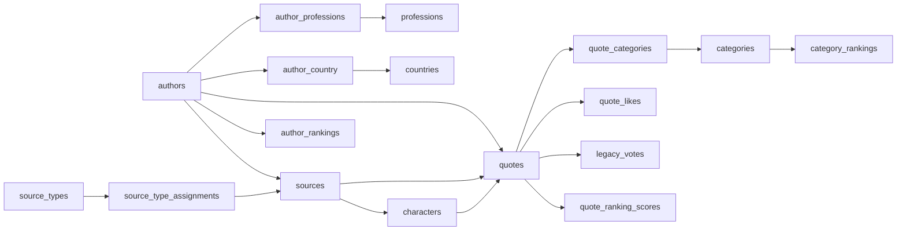

# 第1部: 現行構造の棚卸し

作成日: 2026-07-16

## 1. この文書の範囲

本書は、現行 PostgreSQL / Supabase DB の**構造に関する事実**を棚卸ししたフェーズ1成果物である。アプリからの利用状況はフェーズ2、歪み・重複・廃止候補の判断はフェーズ3、meigen-fly向け新DB設計はフェーズ4で扱う。本書では、現行objectの維持・廃止やSQLiteでの置換方法を判断しない。

### 1.1 情報源と調査方法

構造の正本は、2026-07-16取得の本番schema-only dump `/Users/sonoda/prj/meigen-fly-private/source-db/schema/schema.sql`（SHA-256 `839564a79328a29ab0bd02c52453e82ff832618879271f5b656c67932adc1768`）とした。dumpのDDLをobject種別ごとに再計数し、次を補助資料として突合した。

- `/Users/sonoda/prj/meigensyu/supabase/migrations/`: SQL 98本、CSV asset 2件
- `/Users/sonoda/prj/meigensyu/supabase/seed.sql`: seed bootstrap migrationへ移動済みとのコメントのみ
- `/Users/sonoda/prj/meigensyu/supabase/snippets/`: 空ディレクトリ
- `/Users/sonoda/prj/meigensyu/src/types/supabase.gen.ts`: 生成時点の型
- `/Users/sonoda/prj/meigensyu/docs/database/`、`docs/supabase/`: 設計意図・運用経緯
- `/Users/sonoda/prj/meigensyu/scripts/`: バックアップ、DB管理、データ修正、ランキング再計算資料
- `docs/database/current-system-inventory-task.md`、`current-system-inventory-roadmap.md`、`inventory-0-working-notes.md`、関連ADR

ロードマップの「migration 99本」は現checkoutのファイル数とは一致しない。正確には**migrations SQL 98本、CSV asset 2件、`seed.sql`を加えると調査対象SQL 99本**である。本調査はmigrationを最終構造の正本とせず、objectの由来・変更経緯とdumpとの差異の確認に用いた。

### 1.2 確度ラベル

- **本番dumpで確認**: 配置済みschema-only dumpに定義がある。構造の確認であり、実データや運用状態は含まない。
- **リポジトリ内で一致**: 複数のリポジトリ内資料が一致する。
- **リポジトリから推定**: 根拠はあるが、dumpだけでは意味・運用状態を確定できない。
- **本番確認待ち**: 実データ、DB内の設定行、実行履歴等の追加確認が必要である。

### 1.3 調査上の制約

本番DBへの接続、追加dump取得、SQL実行、Supabase操作は行っていない。dumpはschema-onlyなので、件数・値・NULL分布・重複・孤立参照・sequence現在値・MV populate状態・cron登録行等は確定できない。`.env`等の秘密情報は読まず、`scripts/backup_via_copy.sh`は本文を表示していない。meigensyuおよびdumpは変更していない。

## 2. 全体像

次の集計はすべて **本番dumpで確認**。ロードマップのヘッダー集計と、追加で再計数した内訳は一致した。

| object種別 | 件数 | 一覧・補足 |
|---|---:|---|
| table | 20 | project-planの19表 + `admin_users`。未知の追加tableなし |
| table column | 138 | §3で全列記載 |
| primary key | 20 | 各tableに1件 |
| foreign key | 19 | §3で全件記載 |
| UNIQUE | 13 | PKを除く |
| CHECK | 10 | §3で全件記載 |
| EXCLUDE | 1 | `author_birth_country_unique` |
| ENUM | 2 | `date_precision`, `life_era` |
| sequence | 9 | §4.2 |
| 明示index | 54 | base table 46、MV 8。制約backed indexは別 |
| view | 3 | すべて `security_invoker=on` |
| materialized view | 4 | すべてdump定義は `WITH NO DATA` |
| function/RPC signature | 26 | 24名称。2名称がoverload |
| trigger | 14 | 検証2、検索文書3、`updated_at` 9 |
| extension | 6 | `pg_cron`, `pgroonga`等 |
| RLS有効table | 20/20 | 全table |
| RLS policy | 57 | 19表。`ranking_refresh_logs`は0 |
| 明示GRANT文 | 758行 | function 650、schema 4、sequence 27、table/view/MV 77 |
| default privilege | 12文 | sequence/function/table × 4 role |
| dump内cron schedule定義 | 0 | `cron.job`行データはschema-only dump対象外 |

## 3. テーブル、全カラム、制約、index

表記は `NN` = `NOT NULL`、`D=` = default、記載のない列はNULL可かつdefaultなし。`timestamptz`は`timestamp with time zone`を表す。各DDLの根拠はdump 2731–3405（table）、3508–3710（後付default、PK、UNIQUE、EXCLUDE）、3714–3938（index）、3998–4089（FK）。用途がdumpコメントにあるものはその旨を示し、それ以外は名称・関連からの推定である。

### 3.1 `admin_users`（5列）

用途: 管理ユーザー対応表 **[リポジトリから推定]**。

- カラム: `id uuid NN`; `email text NN`; `role text NN D='admin'`; `created_at timestamptz D=now()`; `updated_at timestamptz D=now()`。
- 制約 **[本番dumpで確認]**: PK `admin_users_pkey(id)`; UNIQUE `admin_users_email_key(email)`; CHECK `role IN ('admin','super_admin')`; FKなし。
- 明示index: なし（PK/UNIQUEのbacking indexは別）。

### 3.2 `author_country`（4列）

用途: 著者と国の関連、生誕国フラグ **[本番dumpのcommentで確認]**。

- カラム: `author_id integer NN`; `country_id integer NN`; `is_birth_country boolean NN D=false`; `created_at timestamptz NN D=CURRENT_TIMESTAMP`。
- 制約 **[本番dumpで確認]**: PK `(author_id,country_id)`; EXCLUDE `author_birth_country_unique USING btree(author_id WITH =) WHERE is_birth_country=true`; FK `author_id→authors.id ON DELETE CASCADE`; FK `country_id→countries.id ON DELETE CASCADE`。
- 明示index: `idx_author_country_author_id(author_id)`; `idx_author_country_birth(author_id,is_birth_country)`; `idx_author_country_comprehensive(author_id,country_id,is_birth_country)`; `idx_author_country_country_id(country_id)`; `idx_author_country_is_birth(author_id,is_birth_country)`。

EXCLUDEは「生誕国=true」を著者ごとに最大1件へ制限する。生誕国を必ず1件持つことまでは保証しない。

### 3.3 `author_professions`（4列）

用途: 著者と職業の順序付き関連 **[リポジトリから推定]**。

- カラム: `author_id integer NN`; `profession_id integer NN`; `created_at timestamptz D=CURRENT_TIMESTAMP`; `display_order integer NN D=1`。
- 制約 **[本番dumpで確認]**: PK `(author_id,profession_id)`; UNIQUE `author_profession_display_order_unique(author_id,display_order)`; CHECK `display_order>=1`; FK `author_id→authors.id ON DELETE CASCADE`; FK `profession_id→professions.id ON DELETE CASCADE`。
- 明示index: `idx_author_professions_author_id(author_id)`; `idx_author_professions_display_order(author_id,display_order)`; `idx_author_professions_profession_id(profession_id)`; `idx_author_professions_profession_order(profession_id,display_order,author_id)`。

### 3.4 `author_rankings`（7列）

用途: 著者ランキング最新snapshot **[本番dumpのcommentで確認]**。

- カラム: `author_id bigint NN`; `rank integer NN`; `score double precision NN`; `total_score double precision NN`; `avg_score double precision NN`; `quote_count integer NN`; `refreshed_at timestamptz NN D=timezone('utc',now())`。
- 制約 **[本番dumpで確認]**: PK `(author_id)`; FK `author_id→authors.id ON DELETE CASCADE`。
- 明示index: `author_rankings_rank_idx(rank)`; `author_rankings_score_idx(score DESC,author_id)`。

### 3.5 `authors`（16列）

用途: 著者master **[リポジトリから推定]**。

- カラム: `id integer NN D=nextval(authors_new_id_seq)`; `name varchar(255) NN`; `slug varchar(255) NN`; `description text`; `image_url text`; `created_at timestamptz D=CURRENT_TIMESTAMP`; `updated_at timestamptz D=CURRENT_TIMESTAMP`; `name_kana varchar(255)`; `name_foreign varchar(255)`; `name_reading varchar(255)`; `birth_date date`; `death_date date`; `birth_era life_era NN D='ad'`; `death_era life_era NN D='ad'`; `birth_precision date_precision NN D='unknown'`; `death_precision date_precision NN D='unknown'`。
- 制約 **[本番dumpで確認]**: PK `authors_new_pkey(id)`; UNIQUE `authors_new_slug_key(slug)`; CHECK 2件: `birth_date IS NULL` iff `birth_precision='unknown'`、`death_date IS NULL` iff `death_precision='unknown'`。
- 明示index: `idx_authors_birth_date(birth_precision,birth_date)`; `idx_authors_death_date(death_precision,death_date)`; `idx_authors_name_reading(name_reading)`; `idx_authors_slug(slug)`。

### 3.6 `categories`（9列）

用途: 2階層category master **[リポジトリから推定]**。

- カラム: `id integer NN D=nextval(categories_id_seq)`; `name varchar(100) NN`; `slug varchar(100) NN`; `description text`; `sort_order integer D=0`; `created_at timestamptz D=CURRENT_TIMESTAMP`; `level integer D=1`; `parent_id integer`; `color varchar(255)`。
- 制約 **[本番dumpで確認]**: PK `(id)`; UNIQUE `(slug)`; CHECK 3件: `categories_level_check: level = ANY (ARRAY[1,2])`; `categories_parent_level_check: ((level=1 AND parent_id IS NULL) OR (level=2 AND parent_id IS NOT NULL))`; `check_category_hierarchy: ((level=1 AND parent_id IS NULL) OR (level>1 AND parent_id IS NOT NULL))`; 自己FK `parent_id→categories.id ON DELETE CASCADE`。
- 明示index: `idx_categories_level(level)`; `idx_categories_parent_id(parent_id)`; `idx_categories_pgroonga USING pgroonga(name)`; `idx_categories_slug(slug)`。

dump commentにはlevel 3の説明が残る一方、実CHECKは1/2だけを許可する **[本番dumpで確認]**。これは文書記述とDDLの差異であり、ここでは是非を判断しない。

### 3.7 `quote_categories`（2列）

用途: 名言とcategoryの関連 **[リポジトリから推定]**。

- カラム: `quote_id integer NN`; `category_id integer NN`。
- 制約 **[本番dumpで確認]**: PK `(quote_id,category_id)`; FK `quote_id→quotes.id ON DELETE CASCADE`; FK `category_id→categories.id ON DELETE CASCADE`。
- 明示index: `idx_quote_categories_category(category_id,quote_id)`。

### 3.8 `quotes`（13列）

用途: 名言本体 **[リポジトリから推定]**。

- カラム: `id integer NN D=nextval(quotes_id_seq)`; `text text NN`; `text_en text`; `author_id integer`; `weight integer D=5`; `slug varchar(255)`; `created_at timestamptz D=CURRENT_TIMESTAMP`; `updated_at timestamptz D=CURRENT_TIMESTAMP`; `source_id integer`; `character_id integer`; `enable boolean D=true`; `context_note text`; `display_language_preference text NN D='ja'`。
- 制約 **[本番dumpで確認]**: PK `(id)`; UNIQUE `(slug)`; CHECK `weight BETWEEN 1 AND 10`; CHECK `display_language_preference IN ('ja','en')`; FK `author_id→authors.id ON UPDATE CASCADE ON DELETE SET NULL`; FK `source_id→sources.id ON UPDATE CASCADE ON DELETE SET NULL`; FK `character_id→characters.id ON DELETE SET NULL`。
- 明示index: `idx_quotes_author_id(author_id)`; `idx_quotes_character_id(character_id)`; `idx_quotes_pgroonga USING pgroonga(text,text_en,context_note)`; `idx_quotes_slug(slug)`; `idx_quotes_source_id(source_id)`; `idx_quotes_text_en_pgroonga USING pgroonga(text_en)`; `idx_quotes_weight(weight DESC)`。

#### ADR 008: ID、qid、slug、公開状態

- dump全体に`qid` tokenまたは独立カラムはない。`quotes.id`はsequence-backed integer PKで、ADR 008の`q{id}`はURL/application mappingとして記述される **[本番dumpで確認 / リポジトリ内で一致]**。
- `quotes.slug`はNULL可。UNIQUEは非NULL重複を禁止するが複数NULLを許し、さらに明示btree indexがある **[本番dumpで確認]**。
- `quotes.enable`は`DEFAULT true`だが`NOT NULL`ではない **[本番dumpで確認]**。
- 旧ID→新ID専用tableはない。`legacy_votes`は旧いいね集計で、ID対応表ではない **[本番dumpで確認]**。
- 他のURL関連slug（authors/categories/characters/countries/professions/source_types/sources）はすべて`NOT NULL + UNIQUE`で、quotesだけがnullableである **[本番dumpで確認]**。
- qid生成規則、slug NULL件数、`enable IS NULL`件数、旧URLとの実際の対応は **[本番確認待ち]**。

#### ADR 009: 表示言語

`display_language_preference`は`text NOT NULL DEFAULT 'ja'`かつCHECK `ja|en`で、ADR 009の物理定義と一致する。`text`はNOT NULL、`text_en`はNULL可だが、空文字は禁止されない。指定側本文が空なら他方へfallbackするというADRの動作はDB制約ではなくアプリの文書上の意図である **[本番dumpで確認 / リポジトリ内で一致]**。値分布、NULL/空文字の組合せは **[本番確認待ち]**。

### 3.9 `category_rankings`（8列）

用途: categoryランキング最新snapshot **[本番dumpのcommentで確認]**。

- カラム: `category_id bigint NN`; `rank integer NN`; `score double precision NN`; `total_score double precision NN`; `avg_score double precision NN`; `adjusted_score double precision NN`; `quote_count integer NN`; `refreshed_at timestamptz NN D=timezone('utc',now())`。
- 制約 **[本番dumpで確認]**: PK `(category_id)`; FK `category_id→categories.id ON DELETE CASCADE`。
- 明示index: `category_rankings_rank_idx(rank)`; `category_rankings_score_idx(score DESC,category_id)`。

### 3.10 `characters`（8列）

用途: 出典内の人物・語り手等 **[リポジトリから推定]**。

- カラム: `id integer NN D=nextval(characters_id_seq)`; `name varchar(255) NN`; `slug varchar(255) NN`; `source_id integer`; `description text`; `character_type varchar(50) D='character'`; `created_at timestamptz D=CURRENT_TIMESTAMP`; `updated_at timestamptz D=CURRENT_TIMESTAMP`。
- 制約 **[本番dumpで確認]**: PK `(id)`; UNIQUE `(slug)`; CHECK `character_type IN ('character','narrator','author_voice')`; FK `source_id→sources.id ON DELETE CASCADE`。
- 明示index: `idx_characters_slug(slug)`; `idx_characters_source_id(source_id)`。

### 3.11 `source_type_assignments`（4列）

用途: 出典と出典種別の関連 **[リポジトリから推定]**。

- カラム: `source_id integer NN`; `type_id integer NN`; `created_at timestamptz NN D=now()`; `updated_at timestamptz NN D=now()`。
- 制約 **[本番dumpで確認]**: PK `(source_id,type_id)`; FK `source_id→sources.id ON DELETE CASCADE`; FK `type_id→source_types.id ON DELETE CASCADE`。
- 明示index: `source_type_assignments_type_id_idx(type_id)`。

### 3.12 `source_types`（7列）

用途: 出典種別master **[リポジトリから推定]**。

- カラム: `id integer NN D=nextval(source_types_id_seq)`; `slug varchar(64) NN`; `name varchar(255) NN`; `display_order integer NN D=0`; `description text`; `created_at timestamptz NN D=now()`; `updated_at timestamptz NN D=now()`。
- 制約 **[本番dumpで確認]**: PK `(id)`; UNIQUE `(slug)`。
- 明示index: `source_types_display_order_idx(display_order)`。

### 3.13 `sources`（9列）

用途: 名言の出典master **[リポジトリから推定]**。

- カラム: `id integer NN D=nextval(sources_id_seq)`; `title varchar(255) NN`; `slug varchar(255) NN`; `author_id integer`; `published_year integer`; `description text`; `created_at timestamptz D=CURRENT_TIMESTAMP`; `updated_at timestamptz D=CURRENT_TIMESTAMP`; `search_document text NN D=''`。
- 制約 **[本番dumpで確認]**: PK `(id)`; UNIQUE `(slug)`; FK `author_id→authors.id ON DELETE SET NULL`。
- 明示index: `idx_sources_author_id(author_id)`; `idx_sources_search_document_pgroonga USING pgroonga(search_document)`; `idx_sources_slug(slug)`。

### 3.14 `countries`（7列）

用途: 国master **[本番dumpのcommentで確認]**。

- カラム: `id integer NN D=nextval(countries_id_seq)`; `name varchar(100) NN`; `name_en varchar(100)`; `code varchar(3)`; `slug varchar(100) NN`; `created_at timestamptz NN D=CURRENT_TIMESTAMP`; `updated_at timestamptz NN D=CURRENT_TIMESTAMP`。
- 制約 **[本番dumpで確認]**: PK `(id)`; UNIQUE `(name)`; UNIQUE `(slug)`。`code`はNULL可でUNIQUEではない。
- 明示index: `idx_countries_code(code)`; `idx_countries_name_slug(name,slug)`。

### 3.15 `legacy_votes`（3列）

用途: 旧サイトから移行した名言別いいね数 **[本番dumpのcommentで確認]**。

- カラム: `quote_id integer NN`; `vote_count integer NN D=0`; `imported_at timestamptz NN D=now()`。
- 制約 **[本番dumpで確認]**: PK `(quote_id)`; FK `quote_id→quotes.id ON DELETE CASCADE`。
- 明示index: なし（PKのbacking indexは別）。

### 3.16 `professions`（7列）

用途: 職業master **[リポジトリから推定]**。

- カラム: `id integer NN D=nextval(professions_id_seq)`; `name varchar(100) NN`; `slug varchar(100) NN`; `description text`; `display_order integer D=0`; `created_at timestamptz D=CURRENT_TIMESTAMP`; `updated_at timestamptz D=CURRENT_TIMESTAMP`。
- 制約 **[本番dumpで確認]**: PK `(id)`; UNIQUE `(name)`; UNIQUE `(slug)`。
- 明示index: `idx_professions_slug(slug)`; `pgroonga_professions_name_index USING pgroonga(name)`。

### 3.17 `quote_likes`（7列）

用途: 匿名いいね履歴 **[本番dumpのcommentで確認]**。

- カラム: `id uuid NN D=gen_random_uuid()`; `quote_id integer NN`; `client_uuid text NN`; `created_at timestamptz NN D=timezone('utc',now())`; `ip_hash text NN`; `user_agent text`; `is_valid boolean NN D=true`。
- 制約 **[本番dumpで確認]**: PK `(id)`; UNIQUE `(quote_id,client_uuid)`; FK `quote_id→quotes.id ON DELETE CASCADE`。
- 明示index: `quote_likes_created_at_idx(created_at DESC)`; `quote_likes_ip_hash_idx(ip_hash)`; partial `quote_likes_valid_created_at_idx(created_at DESC) WHERE is_valid`。

`client_uuid`はPostgreSQL `uuid`型ではなくtextである。一意性は同一名言・同一client_uuid単位で、IP単位ではない。現行DBは`ip_hash`を必須保存し、`user_agent`と無効票flagも保持する **[本番dumpで確認]**。ADR 006は`UNIQUE (quote_id,client_uuid)`と一致する一方、移行先でIP/IP hashを保存しない方針を示す **[リポジトリ内で一致]**。実値形式、invalid票、重複排除やIP制限の運用実態は **[本番確認待ち]**。

### 3.18 `quote_ranking_scores`（6列）

用途: MVから同期される名言ランキング最新値 **[本番dumpのcommentで確認]**。

- カラム: `quote_id integer NN`; `score_total numeric NN`; `likes_total numeric NN`; `likes_7d numeric NN`; `likes_1d numeric NN`; `refreshed_at timestamptz NN`（defaultなし）。
- 制約 **[本番dumpで確認]**: PK `(quote_id)`; FK `quote_id→quotes.id ON DELETE CASCADE`。
- 明示index: `quote_ranking_scores_score_total_idx(score_total DESC,quote_id)`。

### 3.19 `ranking_parameters`（4列）

用途: ランキング係数・閾値設定 **[本番dumpのcommentで確認]**。

- カラム: `key text NN`; `value_numeric numeric`; `value_json jsonb`; `updated_at timestamptz NN D=timezone('utc',now())`。
- 制約 **[本番dumpで確認]**: PK `(key)`。
- 明示index: なし（PKのbacking indexは別）。

### 3.20 `ranking_refresh_logs`（8列）

用途: ランキング再計算実行履歴 **[本番dumpのcommentで確認]**。

- カラム: `id bigint NN D=nextval(ranking_refresh_logs_id_seq)`; `trigger_source text NN D='unknown'`; `status text NN`; `started_at timestamptz NN D=timezone('utc',now())`; `finished_at timestamptz`; `duration_ms integer`; `refreshed_at timestamptz`; `error_message text`。
- 制約 **[本番dumpで確認]**: PK `(id)`。`status`にCHECKはない。
- 明示index: `ranking_refresh_logs_started_idx(started_at DESC)`; `ranking_refresh_logs_status_idx(status)`。

### 3.21 ADR 011に関係する日時・歴史日付

- base tableの時点列は30本で、すべて`timestamptz`。defaultは`CURRENT_TIMESTAMP`、`now()`、`timezone('utc',now())`、defaultなしが混在し、NULL可否も一様でない **[本番dumpで確認]**。
- 例: `quote_ranking_scores.refreshed_at`はNN/defaultなし、`ranking_refresh_logs.finished_at/refreshed_at`はNULL可/defaultなし、`admin_users`と`quotes`のcreated/updatedはdefaultありだがNULL可 **[本番dumpで確認]**。
- 暦日・歴史日付は`authors.birth_date/death_date`の2本（nullable `date`）で、era/precisionとCHECKにより整合する。`sources.published_year`はnullable integerである **[本番dumpで確認]**。
- 実値の精度、offset、UTC正規化状態、NULL件数は **[本番確認待ち]**。ADR 011の移行先形式は設計上の確定方針だが、本節では現行事実との比較に留める。

## 4. 型、sequence、主要関連

### 4.1 ENUM

- `date_precision`: `day | month | year | unknown`
- `life_era`: `bc | ad`

いずれも **[本番dumpで確認]**（dump 62–80）。

### 4.2 sequence

9件すべて **[本番dumpで確認]**: `authors_new_id_seq`, `categories_id_seq`, `characters_id_seq`, `countries_id_seq`, `professions_id_seq`, `quotes_id_seq`, `ranking_refresh_logs_id_seq`, `source_types_id_seq`, `sources_id_seq`。sequence現在値とtable最大IDの整合は **[本番確認待ち]**。

### 4.3 主要な関連



図はFKの主要方向を単純化したもの。`categories.parent_id`は自己参照し、quotesのauthor/source/characterはnullableである **[本番dumpで確認]**。

## 5. view / materialized view / index

### 5.1 通常view（3件）

すべて `security_invoker=on` **[本番dumpで確認]**。

- `characters_with_quote_counts`: character、source、source author/types、公開名言件数。
- `view_admin_kpi_counts`: quotes/authors/categories/professionsの全件数と生成時刻。
- `view_admin_ranking_refresh_logs`: `ranking_refresh_logs`の直接参照view。

### 5.2 materialized view（4件）

dump上はいずれも`WITH NO DATA`定義。これはdump復元時の初期状態であり、本番のpopulate状態や最終refresh時刻は **[本番確認待ち]**。

- `categories_with_counts`: direct/hierarchy/effective quote count。index 4本: `categories_with_counts_effective_count_idx(effective_count,id)`, UNIQUE `categories_with_counts_id_idx(id)`, `categories_with_counts_level_sort_idx(level,sort_order,name)`, `categories_with_counts_parent_sort_idx(parent_id,sort_order,name)`。
- `country_author_counts`: 国別の公開名言著者数・名言数。UNIQUE index `country_author_counts_id_idx(id)`。
- `profession_author_counts`: 職業別の公開名言著者数・名言数。UNIQUE index `profession_author_counts_id_idx(id)`。
- `quote_ranking_scores_mv`: 名言score、累計/7日/1日likes、refresh時刻。UNIQUE `quote_ranking_scores_mv_quote_id_idx(quote_id)`、`quote_ranking_scores_mv_score_total_idx(score_total DESC,quote_id)`。

以上8本と§3のbase-table index 46本で、明示indexは計54本 **[本番dumpで確認]**。PGroonga indexはcategories 1、quotes 2、sources 1、professions 1の計5本である。

## 6. function / RPC（26 signature）

以下は引数型・defaultを含むsignatureと主な役割。すべて **[本番dumpで確認]**。戻りTABLEの全列定義はdump 591–2686にあり、ここでは構造識別に必要な戻り型と日時型の注意点を記す。

1. `_refresh_quote_ranking_scores_internal(trigger_source text='unknown') → void`: ランキング全体の内部更新。
2. `build_author_jsonb(p_author_id integer) → jsonb`。
3. `build_categories_jsonb(p_quote_id integer) → jsonb`。
4. `build_character_jsonb(p_character_id integer) → jsonb`。
5. `build_source_jsonb(p_source_id integer) → jsonb`。
6. `check_display_order_sequence() → trigger`: display orderの大きな飛びを警告。dump上はtrigger未接続。
7. `ensure_category_parent_level() → trigger`: category level/parent整合性。
8. `ensure_quote_categories_level2() → trigger`: level 2 categoryのみ名言へ割当。
9. `get_category_quotes_light(p_category_id integer,p_limit integer=20,p_offset integer=0) → TABLE`: 名言、著者/職業、出典、character、category、score、件数。`created_at/refreshed_at`はtimestamptz。
10. `get_featured_quotes_light(p_limit integer=20) → TABLE`: 上位名言、著者、出典、最大2category、score。`created_at`はtimestamptz。
11. `get_quote_rankings(p_limit integer=20,p_offset integer=0,p_page integer=NULL,p_order_column text='score_total',p_is_ascending boolean=false,p_category_id integer=NULL,p_author_id integer=NULL,p_source_id integer=NULL,p_character_id integer=NULL,p_profession_id integer=NULL,p_search_query text=NULL,p_min_score_total numeric=NULL,p_only_enabled boolean=true) → TABLE`: filter・PGroonga検索付きranking。`created_at`はtimestamp without time zone、`refreshed_at`はtimestamptz。
12. `get_random_quotes(p_limit integer=20,p_offset integer=0,p_category_id integer=NULL,p_author_id integer=NULL,p_source_id integer=NULL,p_character_id integer=NULL) → TABLE`: 公開名言のrandom取得。`created_at/refreshed_at`はtimestamp without time zone。
13. `get_sources_with_quote_counts(p_limit integer=20,p_offset integer=0,p_type_slugs text[]=NULL,p_author_id integer=NULL,p_published_year integer=NULL) → TABLE`: source、author/types、quote/total count。`created_at`はtimestamptz。
14. `get_sources_with_quote_counts(p_limit integer=20,p_offset integer=0,p_type_slugs text[]=NULL,p_author_id integer=NULL,p_published_year integer=NULL,p_include_empty boolean=false,p_search_query text=NULL) → TABLE`: 13の7引数overload。空source包含・PGroonga検索対応。
15. `is_admin() → boolean`: `auth.uid()`と`admin_users`を照合。
16. `list_authors(p_limit integer=20,p_page integer=1,p_sort_by text='quote_count',p_is_ascending boolean=false,p_search text=NULL,p_profession_id integer=NULL,p_country_id integer=NULL) → TABLE`: 著者、歴史日付、職業、国、公開名言数。返却日時はtimestamp without time zone。
17. `list_popular_authors(p_limit integer=20) → TABLE(id,name,slug,description,quote_count)`。
18. `list_professions_overview(p_search text=NULL,p_slug text=NULL,p_category text=NULL,p_limit integer=20,p_offset integer=0) → TABLE`: 職業、著者/名言数、featured quote、総数。
19. `refresh_quote_ranking_scores() → void`: `quote_ranking_scores_mv`のconcurrent refreshのみ。
20. `refresh_quote_ranking_scores(trigger_source text='unknown') → void`: 内部全体更新。失敗時60秒後に1回再試行。
21. `refresh_sources_search_document_after_author_delete() → trigger`。
22. `refresh_sources_search_document_for_author() → trigger`。
23. `search_authors(search_query text,p_limit integer=20,p_offset integer=0,p_count_total boolean=true) → TABLE`: PGroonga著者検索、国・職業・公開名言数。返却日時はtimestamptz。
24. `search_quotes(search_query text,p_limit integer=20,p_offset integer=0,p_count_total boolean=true,p_require_enabled boolean=true) → TABLE`: PGroonga名言検索、著者・出典・work・category。返却日時はtimestamptz。
25. `set_source_search_document() → trigger`。
26. `update_updated_at_column() → trigger`。

`SECURITY DEFINER`は内部ranking更新、refresh両overload、source一覧両overload、`is_admin`、popular authors、profession overviewの計8 signature **[本番dumpで確認]**。戻り日時型はRPCごとに`timestamp`と`timestamptz`が混在する。

## 7. trigger、extension、RLS、grant、定期job

### 7.1 trigger（14件）

すべて **[本番dumpで確認]**。

- 階層検証: `categories_validate_hierarchy`（categories、BEFORE INSERT/UPDATE）、`quote_categories_validate_level`（quote_categories、BEFORE INSERT/UPDATE）。
- source検索文書: `refresh_sources_search_document_after_author_delete`（authors、AFTER DELETE）、`refresh_sources_search_document_for_author`（authors.name、AFTER UPDATE）、`set_source_search_document`（sources、BEFORE INSERT/UPDATE）。
- `updated_at`: `update_admin_users_updated_at`, `update_authors_updated_at`, `update_characters_updated_at`, `update_countries_updated_at`, `update_quotes_updated_at`, `update_ranking_parameters_updated_at`, `update_source_type_assignments_updated_at`, `update_source_types_updated_at`, `update_sources_updated_at`（各tableのBEFORE UPDATE）。

ランキング再計算を直接起動するtriggerはdump内にない。`check_display_order_sequence()`もdump上trigger未接続である。これらを「未使用」とは断定しない。

### 7.2 extension（6件）

すべて **[本番dumpで確認]**。versionはdumpにない。

- `pg_cron` → `pg_catalog`
- `pgroonga` → `public`
- `pg_stat_statements` → `extensions`
- `pgcrypto` → `extensions`
- `supabase_vault` → `vault`
- `uuid-ossp` → `extensions`

`supabase_realtime`はpublication owner変更1行だけがdumpにあり、`CREATE PUBLICATION`やmember追加定義がない。対象tableやpublication設定は確定できない **[本番確認待ち]**。

### 7.3 RLS policy（57件）

全20表でRLS有効、19表に計57 policy **[本番dumpで確認]**。table別の全policy名は次のとおり。

- `admin_users` (1): `admin_users_read_own`
- `author_country` (2): `author_country_admin_write`, `author_country_read_all`
- `author_professions` (2): `Author professions are viewable by everyone`, `author_professions_admin_write`
- `author_rankings` (2): `author_rankings_select_public`, `author_rankings_service_rw`
- `authors` (2): `authors_admin_write`, `authors_read_all`
- `categories` (6): `Allow authenticated write`, `Allow public read`, `categories_admin_delete`, `categories_admin_insert`, `categories_admin_update`, `categories_select_all`
- `category_rankings` (2): `category_rankings_select_public`, `category_rankings_service_rw`
- `characters` (4): `characters_admin_delete`, `characters_admin_insert`, `characters_admin_update`, `characters_read_all`
- `countries` (2): `countries_admin_write`, `countries_read_all`
- `legacy_votes` (2): `legacy_votes_select_public`, `legacy_votes_service_rw`
- `professions` (1): `Professions are viewable by everyone`
- `quote_categories` (6): `Allow authenticated write`, `Allow public read`, `quote_categories_admin_delete`, `quote_categories_admin_insert`, `quote_categories_admin_update`, `quote_categories_select_all`
- `quote_likes` (4): `Allow service role select`, `quote_likes_insert_for_service`, `quote_likes_no_delete_for_clients`, `quote_likes_no_update_for_clients`
- `quote_ranking_scores` (2): `quote_ranking_scores_select_public`, `quote_ranking_scores_service_rw`
- `quotes` (6): `Allow authenticated write`, `Allow public read`, `quotes_admin_delete`, `quotes_admin_insert`, `quotes_admin_update`, `quotes_select_all`
- `ranking_parameters` (1): `ranking_parameters_select_policy`
- `ranking_refresh_logs` (0): RLS有効だがpolicyなし
- `source_type_assignments` (4): `source_type_assignments_admin_delete`, `source_type_assignments_admin_insert`, `source_type_assignments_admin_update`, `source_type_assignments_select_all`
- `source_types` (4): `source_types_admin_delete`, `source_types_admin_insert`, `source_types_admin_update`, `source_types_select_all`
- `sources` (4): `sources_admin_delete`, `sources_admin_insert`, `sources_admin_update`, `sources_read_all`

categories、quote_categories、quotesでは旧来の包括的authenticated-write/public-read policyと、`is_admin()`を使う操作別policy/select policyが併存する **[本番dumpで確認]**。これは現在構造の記録であり、整理判断ではない。

### 7.4 grant / default privilege

- 明示GRANT 758行: app function 26 signature × `anon/authenticated/service_role` = 78、PGroonga由来143 signature × `postgres/anon/authenticated/service_role` = 572、schema 4、sequence 27、table/view/MV 77 **[本番dumpで確認]**。
- `public` schemaは4 roleへUSAGE。9 sequenceは`anon/authenticated/service_role`へALL。default privilegeはsequence/function/table × 4 roleの12文。REVOKEはない **[本番dumpで確認]**。
- 全26 app functionに3 roleへの明示ALLがあり、8件の`SECURITY DEFINER`も含む。実効accessはRLS、function owner、Supabase role挙動との組合せになる **[本番dumpで確認 / 本番確認待ち]**。

#### table / view / MV GRANT 77行の圧縮matrix

次のmatrixはdumpの77文を、同一privilege patternを持つobject群ごとに圧縮したもの。`S`=`SELECT`、`I`=`INSERT`、`D`=`DELETE`、`M`=`MAINTAIN`、`U`=`UPDATE`。セルの数は「object数 × 当該roleへのGRANT文1件」であり、各object名は1行だけに属する **[本番dumpで確認]**。

| object（件数） | `anon` | `authenticated` | `service_role` | GRANT文数 |
|---|---|---|---|---:|
| `admin_users`, `countries` (2) | `S,M` | `S,M` | `S,M` | 6 |
| `author_country`, `author_professions`, `authors`, `categories`, `quote_categories`, `quotes`, `professions` (7) | `S,M` | `S,M` | `S,I,D,M,U` | 21 |
| `author_rankings`, `categories_with_counts`, `category_rankings`, `legacy_votes`, `quote_likes`, `quote_ranking_scores`, `ranking_parameters`, `quote_ranking_scores_mv`, `ranking_refresh_logs` (9) | `ALL` | `ALL` | `ALL` | 27 |
| `characters` (1) | `S,M` | `S,M` | `ALL` | 3 |
| `source_type_assignments`, `source_types`, `sources` (3) | `S,M` | `S,I,D,M,U` | `ALL` | 9 |
| `characters_with_quote_counts` (1) | `S` | `S` | `ALL` | 3 |
| `country_author_counts`, `profession_author_counts` (2) | `S` | `S` | `ALL` | 6 |
| `view_admin_kpi_counts`, `view_admin_ranking_refresh_logs` (2) | — | — | `ALL` | 2 |
| **合計: 27 object** |  |  |  | **77** |

このmatrixは明示GRANT文そのものの棚卸しである。たとえば`admin_users`は3 roleに`SELECT,MAINTAIN`、source関連3 objectはauthenticatedにwrite privilege、quote_likesおよびranking関連objectは3 roleに`ALL`、管理view 2件はservice_roleだけに`ALL`を持つ。ただし、GRANTだけで実際の可否は決まらない。57 RLS policy、RLS未policyの`ranking_refresh_logs`、viewの`security_invoker`、function owner/`SECURITY DEFINER`、Supabase roleの組合せを含む実効権限は **[本番確認待ち]**。

### 7.5 `pg_cron`等の定期job

dumpには`pg_cron` extension定義はあるが、`cron.schedule`/`unschedule`定義は0件。schema-only dumpでは`cron.job`の行データを確認できないため、job登録、schedule、active状態、実行履歴は **[本番確認待ち]**。

migrationには次の登録意図がある **[リポジトリ内で一致]**。

- `refresh_quote_ranking_scores_scheduler`: `0 3,15 * * *`、`refresh_quote_ranking_scores('scheduler')`
- `refresh_categories_with_counts_scheduler`: `0 3 * * *`、`categories_with_counts`をCONCURRENTLY refresh

## 8. ランキング関連objectのまとまり

ランキングは複数objectが一組を構成する **[本番dumpで確認 / リポジトリ内で一致]**。

```mermaid
flowchart TD
  Q[quotes.weight] --> MV[quote_ranking_scores_mv]
  L[quote_likes: valid / time] --> MV
  V[legacy_votes.vote_count] --> MV
  P[ranking_parameters] --> MV
  MV -->|concurrent refresh / sync| S[quote_ranking_scores]
  S --> C[category_rankings]
  S --> A[author_rankings]
  QC[quote_categories] --> C
  Q2[quotes.enable / author_id] --> C
  Q2 --> A
  F[refresh_quote_ranking_scores(text)] --> I[_refresh_quote_ranking_scores_internal]
  I --> LOG[ranking_refresh_logs]
  I --> MV
  I --> S
  I --> C
  I --> A
```

- 引数なし`refresh_quote_ranking_scores()`はMVだけを更新し、score table、category/author ranking、logを同期しない。text引数版は内部全体更新を呼ぶ **[本番dumpで確認]**。
- `get_featured_quotes_light`, `get_quote_rankings`, `get_random_quotes`, `get_category_quotes_light`, `list_professions_overview`は主に`quote_ranking_scores`を参照する **[本番dumpで確認]**。
- MV concurrent refreshを支えるUNIQUE indexは`quote_ranking_scores_mv_quote_id_idx` **[本番dumpで確認]**。
- どのoverloadを定期実行しているか、各snapshot/MVの鮮度、job実在は **[本番確認待ち]**。

## 9. migrationによる由来・変更経緯

`20240101000000_initial_schema.sql`が13 table、2 ENUM、基本function/trigger/RLS/indexのbaseline。現在の20 tableとの差分7件は次の由来 **[リポジトリ内で一致 / 本番dumpで確認]**。

- `quote_likes`: `20251023023913_quote-likes.sql`
- `ranking_parameters`: `20251023050036_ranking-parameters.sql`
- `ranking_refresh_logs`: `20251023143524_ranking-refresh-logs.sql`
- `quote_ranking_scores`: `20251023051647_quote-ranking-scores.sql`では同名通常view、`20251025093000_quote-ranking-scores-table.sql`でtableへ置換
- `category_rankings`, `author_rankings`: `20251026022432_category-author-rankings.sql`
- `legacy_votes`: `20260111163754_create-legacy-votes.sql`; `20260111163755_add-legacy-votes-to-ranking.sql`でranking MVへ統合

後続の主なtable DDLはすべてdumpへ反映され、説明できないtable column/constraint driftは見つからなかった。

- `quotes.slug`のNOT NULL解除: `20251110094348_quotes_slug_nullable.sql`
- `authors.profession`と関連index削除: `20251116104411_drop-authors-profession.sql`
- `sources.search_document text NOT NULL DEFAULT ''`、PGroonga index、保守function/trigger: `20251116071934_sources-search-and-filter.sql`; author削除追随修正: `20251116074902_sources-search-query-escape-fix.sql`

view/MVの主な履歴:

- `categories_with_counts`: `20251107055742_categories_with_counts_view.sql`でview、`20251114064443_enable-only-counts.sql`で公開名言のみ、`20251219233201_categories_with_counts_materialized_view.sql`でMV化・cron登録、`20251223023053_fix_hierarchy_count_distinct.sql`でDISTINCT化。
- `characters_with_quote_counts`: `20251107074749_characters_with_quote_counts_view.sql`; total count追加後、`20251107123010_characters_view_remove_total_count.sql`で削除。
- `profession_author_counts`, `country_author_counts`: `20251117093000_author_filters_counts_view.sql`。
- 管理view 2件: `20251204092709_admin-dashboard-views.sql`。
- view 3件の`security_invoker=on`: `20260211034522_enable-security-invoker-on-views.sql`。
- `quote_ranking_scores_mv`: `20251023051647_quote-ranking-scores.sql`、enable-only化、legacy votes統合。

主要function/RPCの履歴:

- 削除済み: author create/update/debug、`get_authors_with_counts`, `search_categories`, `get_category_hierarchy`, `list_quotes_by_profession`。根拠は`20251104082702_remove_author_rpcs.sql`, `20251104115046_remove_unused_author_category_rpcs.sql`, `20251104160000_remove_unused_author_category_rpcs_cleanup.sql`, `20251226094728_remove_get_category_hierarchy_rpc.sql`, `20251226161644_drop-list-quotes-by-profession.sql`。
- `search_authors`, `search_quotes`: baseline、`20250415120000_fix_search_authors_operator.sql`, `20251107143000_search_rpcs_pagination.sql`。
- `get_sources_with_quote_counts`: `20251103123345_get_sources_with_quote_counts.sql`, `20251116071934_sources-search-and-filter.sql`, `20251116074902_sources-search-query-escape-fix.sql`。5/7引数overloadがdumpに残る。
- ranking/light/random: `20251025125954_quote-ranking-rpc.sql`, `20251219081944_get-featured-quotes-light.sql`, `20251220235158_get-category-quotes-light.sql`以降、`20251224114655_get-random-quotes-rpc.sql`, `20251227235001`～`003` JSON helper/refactor, `20260113181640_fix-get-quote-rankings-refreshed-at-timestamptz.sql`。
- `list_authors`: `20251228161242_list-authors-rpc.sql`。

data migrationは初期seed、category再編、profession/source type統合、quote/source/character/country cleanup、legacy votes投入等の系統があるが、schema-only dumpから適用件数や現在値は確定できない。

## 10. dump・migration・生成型・文書間の差異

| 対象 | 確認した差異 | 確度・根拠 |
|---|---|---|
| migration本数 | ロードマップは99本。現checkoutはSQL 98本 + CSV asset 2件。`seed.sql`を加えると調査対象SQL 99本 | **リポジトリ内で一致**: `supabase/migrations/`, `seed.sql` |
| table一覧 | dump 20表はproject-planの19表 + `admin_users`。table単位driftなし | **本番dumpで確認 / リポジトリ内で一致** |
| table column/constraint | 後続migrationを含めdumpに反映。説明できないdriftなし | **本番dumpで確認 / リポジトリ内で一致** |
| 生成型 | `supabase.gen.ts`は19表135列、dumpは20表138列。差は`legacy_votes`と3列だけ。共通135列の名称・NULL可否、生成型の`Views` section 7件（dumpではview 3 + MV 4）、ENUM 2件は一致 | **本番dumpで確認 / リポジトリ内で一致**: `src/types/supabase.gen.ts` 36–960, 1637–1640 |
| 生成型の表現限界 | trigger function、MV区別、CHECK/index/RLS/grant/`security_invoker`等を完全には表現しない | **リポジトリ内で一致** |
| extension | baselineに`pg_graphql`があるがdumpにない。dumpの`pg_cron` CREATE EXTENSIONはmigrationにない。`uuid-ossp`, `pgcrypto`, `pg_stat_statements`, `supabase_vault`の配置schemaも異なる | **本番dumpで確認 / リポジトリ内で一致**。原因は断定しない |
| ACL意図と実態 | `20251210031327_secure-view-permissions.sql`はview/MV権限を絞る意図。一方、default privilegeと後続MV再作成により、dumpの`categories_with_counts`と`quote_ranking_scores_mv`には3 roleへのGRANT ALLがある | 実ACL **本番dumpで確認**、由来 **リポジトリ内で一致** |
| `schema-design.md` | `legacy_votes`のranking統合を欠き、管理者RLSのSQL例も現行dumpと一致しない | **本番dumpで確認 / リポジトリ内で一致**: `docs/database/schema-design.md` |
| admin dashboard文書 | view定義は記載するが、後続の`security_invoker=on`は未記載 | **本番dumpで確認 / リポジトリ内で一致**: `docs/supabase/views/admin-dashboard.md`, `20260211034522_enable-security-invoker-on-views.sql` |
| category comment | dump commentはlevel 3を説明するが、CHECKは1/2のみ | **本番dumpで確認** |
| RPC日時型 | base table時点列はtimestamptzだが、一部RPC returnにtimestamp without time zoneが残る | **本番dumpで確認** |
| script集計 | ロードマップのscripts 31件は再現できず、現checkoutはtracked 43件、うちcode/SQL 38件 | **リポジトリ内で一致**。取得時点または集計定義差と推定 |
| sample import | `scripts/import-sample-data.sql`が現行にないcolumnを参照 | **リポジトリ内で一致** |

`legacy_votes`は`20260111163754_create-legacy-votes.sql`で追加され、生成型の最終更新commit（2025-12-28）はそれ以前なので、差異は生成時点差として説明可能である。ただし、実際の生成元環境は **[本番確認待ち]**。生成型はtrigger-returning 7 functionを表現せず、overloadも名称単位またはArgs unionで表すため、全function signatureの正本にはできない。`seed.sql`はbootstrapを`20251015000000_seed-data-bootstrap.sql`へ移動した旨のコメントだけで、snippetsは空。

文書上の意図と現行事実は分離した。`schema-design.md`の管理者RLS例は現行にない`admin_users.is_active`やemail JWT判定を含む一方、dumpの`is_admin()`は`id=auth.uid()`とroleで判定し、policyはread-own 1件である。同文書の毎日backup/PITR・12時間cron継続は運用意図として参照したが、schema-only dumpでは実在を確定できない。`docs/supabase/sql/public.get_authors_with_counts.template.sql`は将来用templateでdumpにない削除済みfunction、`public.get_sources_with_quote_counts.template.sql`は7引数版の参考実装であり、いずれもdump object数へ加えていない。

## 11. 運用・管理scriptから確認した構造上の情報

- `scripts/rankings-refresh.ts`はdumpのランキング一式と整合する **[リポジトリ内で一致]**。
- `scripts/fix-sequences.sql`はdumpの9 sequenceと整合する **[リポジトリ内で一致]**。
- `scripts/cleanup-orphaned-relations.sql`、category/author import・tagging系、日付分析・修正系、source RPC検証系等が存在する。実行実績、対象件数、現在の適用状態は **[本番確認待ち]**。

資格情報管理上の問題候補が次の運用資料で確認された。秘密値は記載しない。

- `/Users/sonoda/prj/meigensyu/scripts/backup_via_copy.sh`: 接続情報を含む可能性がある既知のbackup script。本文は再表示していない。
- `/Users/sonoda/prj/meigensyu/scripts/create-admin-user.js`, `create-admin-user.ts`: 管理者資格情報様literalと資格情報のlog出力。
- `/Users/sonoda/prj/meigensyu/scripts/sync-staging-data.sh`, `sync-staging-data-supabase.sh`: 接続用password/DB URI様literalと同期・reset・restore処理。対象環境guardの十分性は本調査では断定しない。
- `scripts/backup_supabase.sh`: full/schema/主要table dumpと30日retention、restore案内。`scripts/backup_supabase_mcp.sh`: SQL/Python artifactと手動MCP手順生成。いずれも成功実績・復元可能性は未検証であり、資格情報問題は断定しない。

対応案: 当該資格情報の実在・有効性を安全に確認し、有効なら失効・rotation、repository履歴確認、secret管理への移行、log出力削除、対象環境guard強化を行う。これは運用上の安全対応案であり、DB構造の維持・廃止提案ではない。

## 12. 本番確認待ち（フェーズ5への引き継ぎ）

schema-only dumpでは確定できないため、次をフェーズ5で取得項目へ集約する。

1. 全tableの行数、column別NULL数、値分布、重複、孤立参照、常にNULL/同値のcolumn。
2. PK/sequenceの現在値、最大IDとの整合。
3. `quotes.slug` NULL数、`enable IS NULL`数、qid生成・旧ID・redirect・既存URLの実対応。
4. `text/text_en`のNULL/空文字組合せ、`display_language_preference`値分布とfallback対象数。
5. timestamptz実値の精度、offset、UTC正規化、各時点列のNULL数。歴史日付のprecision/era分布。
6. `quote_likes`: client_uuid形式、invalid票、重複排除、IP日次制限の実態、`ip_hash/user_agent`分布を必要最小限・安全な集計で確認。
7. `legacy_votes`の行数・値分布・名言との対応、data migrationの適用結果。
8. `author_country`の生誕国付与状況、0件/複数候補、関連表の孤立・重複。
9. `ranking_parameters`のkey/value、`ranking_refresh_logs.status`実値集合、各snapshotの鮮度。
10. 4 MVのpopulate状態・最終refresh時刻。
11. cron job 2件の実在、schedule、active、実行履歴、実際に呼ぶoverload。
12. extension version、`pg_graphql`/`pg_cron`/配置schema差異の由来。
13. RLSとgrant/default privilegeを組み合わせた実効権限、MV再作成後ACLの運用意図。
14. `supabase_realtime` publicationの実在、member、設定。
15. 生成型の生成元環境・生成時点、seed/data migrationの現在データとの一致。
16. backup成功状況、復元試験、PITR設定、各運用scriptの実行実績・対象環境。
17. 資格情報様literalが実値か、すでに失効済みか。値を表示せず確認する。

## 13. フェーズ2への引き継ぎ

フェーズ2では本書の全objectを母集団とし、利用箇所の有無をアプリコードから確認する。特に次を一組として追跡する。

- URL互換性: `quotes.id/slug/enable`、各masterのslug、qid組立、旧URL redirect。DBにqid列・ID対応表がないため、application側の解決根拠を確認する。
- 表示言語: `text/text_en/display_language_preference`と、fallback resolverの全consumer。
- いいね: `quote_likes`, `legacy_votes`, likes API、集計・rate limit・invalid化処理。
- ランキング: `quote_ranking_scores_mv`, `quote_ranking_scores`, `category_rankings`, `author_rankings`, `ranking_parameters`, `ranking_refresh_logs`, refresh両overload、取得RPC、cron相当script。
- category: 2階層CHECK、割当trigger、`categories_with_counts`、公開件数consumer。
- 検索: 5本のPGroonga index、`sources.search_document`保守trigger、search RPCと通常query。
- 管理: `admin_users`, `is_admin()`, 57 RLS policy、管理view 2件、実際のSupabase Auth/RLS経路。
- 日時: base tableのtimestamptzとRPC返却型の混在を、各consumerがどう扱うか。
- 全3 view、4 MV、26 function signature、14 triggerについて、利用箇所あり／repository内で利用箇所なしを根拠付きで記録する。

本節は調査対象の引き継ぎであり、使用中/未使用、維持/廃止、移行方式をまだ判断しない。
