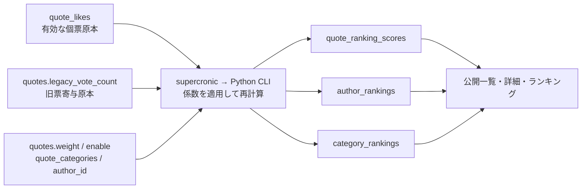

# 第4部: meigen-fly向けDB概念設計

作成日: 2026-07-17

## 1. この文書の範囲と結論

本書は、第1部の現行構造、第2部の利用状況、第3部の分類を受け、FastAPI + SQLAlchemy Core + SQLite向けの概念設計を提示する。対象はテーブル、主要カラム、制約、索引、データの責務、代表クエリと移行判断までである。DDL、Alembic revision、SQLAlchemy定義、移行・アプリコードは扱わない。

提案は **16テーブル**（原本・関連13表、定期再計算snapshot 3表）である。現行20表から、`admin_users`を除外し、`legacy_votes`を`quotes`へ統合し、`ranking_parameters`と`ranking_refresh_logs`をDB外の処理・運用へ置換する。現行の3 snapshot表は責務を維持する。これは第3部§2.1、§4.2–4.4、§7.1を具体化した案である **[本番dumpで確認／リポジトリ内で一致]**。

本案の「既定案」は、フェーズ5の実データ確認前に実装を確定するという意味ではない。§12に挙げる条件が成立しなければ、同節の分岐に従って制約または移行範囲を見直す。

## 2. 設計の前提

### 2.1 ADRとフェーズ3の制約

- SQLiteは単一Fly Volume上でWALを使い、接続ごとに外部キーを有効化する。DBをクライアントへ直接公開しない（ADR 001、第3部§4.12） **[リポジトリ内で一致]**。
- DBアクセスはSQLAlchemy Core、migrationはAlembicとし、制約・索引へ一貫した命名規約を設ける。本書では具体名や実装を書かない（ADR 004） **[リポジトリ内で一致]**。
- 初期検索はbind parameterとwildcard escapeを使う`LIKE`である。PGroonga、FTS、bigram、`sources.search_document`を持ち込まない（ADR 002、第3部§4.14・§7.1） **[リポジトリ内で一致]**。
- ranking再計算はsupercronicからPython CLIを起動する。CLIは短いtransactionで3 snapshotを一方向に更新し、失敗時は前回正常結果を残す（ADR 005、第3部§4.3） **[リポジトリ内で一致]**。
- 匿名いいねは`(quote_id, client_uuid)`で冪等とし、IP・IP hashを保存しない（ADR 006、第3部§4.11） **[リポジトリ内で一致]**。
- 現行ID、slug、公開状態と`q{id}`解決を保持する。qid専用列は作らない（ADR 008、第1部§3.8、第2部§7） **[本番dumpで確認／リポジトリ内で一致]**。
- `display_language_preference`は`ja|en`、NOT NULL、既定`ja`とし、本文選択は共通resolverでfallbackする（ADR 009、第3部§4.9） **[本番dumpで確認／リポジトリ内で一致]**。
- 「時点」は固定長UTC TEXT、歴史日付はera・precisionとともに暦日として扱う（ADR 011、第3部§4.15） **[リポジトリ内で一致]**。
- 管理認証はCloudflare Access + 外部IdPであり、`admin_users`、Supabase Auth、RLS、GRANTを持ち込まない（ADR 012、第3部§4.12） **[リポジトリ内で一致]**。

### 2.2 判断基準の適用

作業指示書の12基準に対し、本案は次のように適用する。

| 基準 | 本案での適用 |
|---|---|
| 1. 欠損なく保持 | コンテンツ、関連、公開状態、現行ID/slug、likes、旧票寄与を原本側に保持する |
| 2. 単純なクエリ | 一覧・詳細・集計を通常のJOIN、EXISTS、GROUP BYで構成する（§9） |
| 3. 基本整合性 | FK、UNIQUE、CHECK、必要最小限のSQLite互換trigger/部分UNIQUE索引で保証する |
| 4. PostgreSQL依存排除 | ENUM、EXCLUDE、MV、RPC、RLS、PGroonga、`pg_cron`を持ち込まない |
| 5. 原本と派生の分離 | 13表を原本・関連、3表を再生成可能snapshotと明記する |
| 6. 不要cache等を除外 | 件数view/MV、検索派生列、KPI view、ranking中間MVを作らない |
| 7. 規模比例 | 約2,100名言・約890著者では件数をリアルタイム集計し、ランキングだけsnapshot化する |
| 8. 将来向け構造を追加しない | qid表、権限表、汎用設定表、outbox、検索専用表を追加しない |
| 9. 理解しやすい名称 | 現在のドメイン名を維持し、旧票だけ明示的な列名へ統合する |
| 10. 移行・復旧容易 | 現行IDを明示投入でき、派生3表は原本から再生成できる |
| 11. SQLiteに自然 | `INTEGER/REAL/TEXT`、部分UNIQUE索引、単純FKを使う |
| 12. URL互換 | ID・slug・公開状態を保持し、qidはIDから決定的に生成する |

判断基準の出典は作業指示書「新DB設計の判断基準」、規模と単純化の根拠は第2部§3、第3部§4.5・§7.1である **[リポジトリ内で一致／性能はリポジトリから推定]**。

### 2.3 表記、型、ID共通方針

- 以下の表では`NN`をNULL不可、`NULL`をNULL可とする。booleanはSQLiteの`INTEGER`で`0|1` CHECKを付ける。
- すべての「時点」TEXTは`YYYY-MM-DDTHH:MM:SS.ffffffZ`の固定長27文字とし、NN列は必ず明示serializerから設定する。DBの`CURRENT_TIMESTAMP`は使わない（ADR 011、第1部§3.21） **[リポジトリ内で一致]**。
- 既存の数値IDはそのまま明示投入する。`authors`等のSQLite `INTEGER PRIMARY KEY`はrowid aliasを使い、`AUTOINCREMENT`を付けない。削除済みIDの再利用が公開qidを別内容へ向け得る`quotes`だけは`AUTOINCREMENT`を付ける既定案とする。現行sequence値と最大IDを確認し、quoteの高水位も引き継ぐ（ADR 008、第1部§4.2・§12.2） **[構造は本番dumpで確認／高水位は本番確認待ち]**。
- 中間表とsnapshot表は自然キーを主キーとし、人工IDを追加しない。`quote_likes`も`(quote_id, client_uuid)`を主キーとし、現行row UUIDは外部consumerがないことを確認後に除く（第3部§4.11） **[リポジトリから推定／本番確認待ち]**。
- FKの`ON UPDATE`はID不変を前提に指定しない。ID変更を通常操作として許可せず、URL互換性を守る。

## 3. 提案テーブル一覧

| # | テーブル | 責務 | 区分 | 現行との主な差 |
|---:|---|---|---|---|
| 1 | `authors` | 著者masterと歴史日付 | 原本 | 日時・ENUM相当をSQLite表現へ |
| 2 | `professions` | 職業master | 原本 | 検索専用索引を除外 |
| 3 | `author_professions` | 順序付き著者–職業関連 | 原本関連 | 責務維持 |
| 4 | `countries` | 国master | 原本 | codeの実値確認を保留 |
| 5 | `author_country` | 著者の関連国と生誕国 | 原本関連 | EXCLUDEを部分UNIQUE索引へ |
| 6 | `source_types` | 出典種別master | 原本 | 責務維持 |
| 7 | `sources` | 出典本体 | 原本 | `search_document`を削除 |
| 8 | `source_type_assignments` | 出典–種別関連 | 原本関連 | 多対多を既定案として維持 |
| 9 | `characters` | 出典中の人物・語り手等 | 原本 | 出典削除時をSET NULLへ |
| 10 | `categories` | 2階層カテゴリmaster | 原本 | 重複CHECKを整理、親level検証を明示 |
| 11 | `quotes` | 名言本文、公開・URL属性、旧票寄与 | 原本 | `legacy_vote_count`を統合、enableをNN化 |
| 12 | `quote_categories` | 名言–level 2カテゴリ関連 | 原本関連 | level 2検証を明示 |
| 13 | `quote_likes` | 匿名いいね原本 | 原本イベント | row UUID・IP・UAを除外する既定案 |
| 14 | `quote_ranking_scores` | 名言ランキング最新snapshot | 派生 | 中間MVなしでCLIが再計算 |
| 15 | `author_rankings` | 著者ランキング最新snapshot | 派生 | CLIが再計算 |
| 16 | `category_rankings` | カテゴリランキング最新snapshot | 派生 | CLIが再計算 |

一覧の根拠は第3部§2.1の維持12・再編4・置換2・廃止1・確認待ち1、および§7.1である。テーブル数を目的に削減したのではなく、再構築不能なデータと現在の機能責務から導いた **[本番dumpで確認／リポジトリ内で一致]**。

## 4. テーブル別詳細: コンテンツmaster

### 4.1 `authors`

| カラム | SQLite型 | NULL | 意味・制約 |
|---|---|---|---|
| `id` | INTEGER | NN | PK、現行ID引継ぎ、AUTOINCREMENTなし |
| `name` | TEXT | NN | 表示名 |
| `slug` | TEXT | NN | UNIQUE、公開URL識別子 |
| `description` | TEXT | NULL | 説明 |
| `image_url` | TEXT | NULL | 画像URL |
| `name_kana` | TEXT | NULL | かな表記 |
| `name_foreign` | TEXT | NULL | 外国語表記 |
| `name_reading` | TEXT | NULL | 一覧・sort用読み |
| `birth_date` / `death_date` | TEXT | NULL | 歴史上の暦日。UTC変換しない |
| `birth_era` / `death_era` | TEXT | NN | `bc|ad`、既定`ad` |
| `birth_precision` / `death_precision` | TEXT | NN | `day|month|year|unknown`、既定`unknown` |
| `created_at` / `updated_at` | TEXT | NN | 固定長UTC時点 |

- PK/ID: `id`。現行値を維持し、AUTOINCREMENTは不要。
- CHECK: precisionと日付は「`unknown`なら日付NULL、その他なら日付NN」。日付は正規化済み`YYYY-MM-DD`を受け、eraは`bc|ad`。DBでは少なくともAD出生→BC死亡を拒否する。両端が`day`精度の場合だけ、AD同士は通常の日付順、BC同士は「出生年>死亡年、または同年かつ出生月日≦死亡月日」で明白な逆転を拒否する。BCでは年の順序だけが反転し、同一年内の月日は反転しないため、固定長日付全体を単純に逆比較しない。month/year精度を含む期間の重なりはアプリでera-awareな区間として検証する。日付の実値表現と不完全日付の格納状態が適合しない場合は制約投入前に§12の分岐を適用する。
- 索引: UNIQUE slugのbacking索引に加え、著者一覧順の`(name_reading, id)`だけを候補とする。`%LIKE%`用のbtree索引は追加しない。
- 削除: 参照元は各表で定義する。著者自体の削除は管理側で影響を確認してから行う。

責務・列は第1部§3.5、歴史日付は第1部§3.21・第3部§4.15、公開利用は第2部§3に基づく **[本番dumpで確認／リポジトリ内で一致、実値は本番確認待ち]**。

### 4.2 `professions`

| カラム | 型 | NULL | 意味・制約 |
|---|---|---|---|
| `id` | INTEGER | NN | PK、現行ID引継ぎ、AUTOINCREMENTなし |
| `name` | TEXT | NN | UNIQUE |
| `slug` | TEXT | NN | UNIQUE、公開URL識別子 |
| `description` | TEXT | NULL | 説明 |
| `display_order` | INTEGER | NN | 既定0、0以上 |
| `created_at` / `updated_at` | TEXT | NN | 固定長UTC時点 |

- FKなし。索引は2つのUNIQUE backingと一覧用`(display_order, id)`。PGroonga索引は作らない。
- 根拠: 第1部§3.16、第2部§3、第3部§4.14 **[本番dumpで確認／リポジトリ内で一致]**。

### 4.3 `countries`

| カラム | 型 | NULL | 意味・制約 |
|---|---|---|---|
| `id` | INTEGER | NN | PK、現行ID引継ぎ、AUTOINCREMENTなし |
| `name` | TEXT | NN | UNIQUE |
| `name_en` | TEXT | NULL | 英語名 |
| `code` | TEXT | NULL | 最大3文字。重複禁止は実値確認後 |
| `slug` | TEXT | NN | UNIQUE、公開URL識別子 |
| `created_at` / `updated_at` | TEXT | NN | 固定長UTC時点 |

- CHECK: `code IS NULL OR length(code) BETWEEN 2 AND 3`を既定案とする。大文字化・ISO限定は現行値確認前に強制しない。
- 索引: UNIQUE name/slug。国code filterを使うため`code`索引を1本置く。codeが一意と確認できれば通常索引をUNIQUEへ置き換える。
- 根拠: 第1部§3.14、第2部§3、第3部§4.6 **[本番dumpで確認／code値域は本番確認待ち]**。

### 4.4 `source_types`

| カラム | 型 | NULL | 意味・制約 |
|---|---|---|---|
| `id` | INTEGER | NN | PK、現行ID引継ぎ、AUTOINCREMENTなし |
| `slug` | TEXT | NN | UNIQUE、filter識別子 |
| `name` | TEXT | NN | 表示名 |
| `display_order` | INTEGER | NN | 既定0、0以上 |
| `description` | TEXT | NULL | 説明 |
| `created_at` / `updated_at` | TEXT | NN | 固定長UTC時点 |

- 索引: UNIQUE slugと一覧用`(display_order, id)`。
- 根拠: 第1部§3.12、第2部§3、第3部§4.7–4.8 **[本番dumpで確認／リポジトリ内で一致]**。

### 4.5 `sources`

| カラム | 型 | NULL | 意味・制約 |
|---|---|---|---|
| `id` | INTEGER | NN | PK、現行ID引継ぎ、AUTOINCREMENTなし |
| `title` | TEXT | NN | 出典名 |
| `slug` | TEXT | NN | UNIQUE、公開URL識別子 |
| `author_id` | INTEGER | NULL | FK→`authors.id`、ON DELETE SET NULL |
| `published_year` | INTEGER | NULL | 刊行年。UTC時点ではない |
| `description` | TEXT | NULL | 説明 |
| `created_at` / `updated_at` | TEXT | NN | 固定長UTC時点 |

- `search_document`は置かない。検索は`title`とJOINした著者名へ直接escaped LIKEを行う。
- CHECK: `published_year`は現行が西暦年だけなら1以上の妥当な上限内とする。BC・不詳記号等があれば、フェーズ5後にera/precision列を追加するか値をNULLへ変換する判断が必要であり、勝手に補正しない。
- 索引: UNIQUE slug、FK用`author_id`。
- 削除: 著者削除でも出典本文を残すためSET NULL。現行動作とも一致する。
- 根拠: 第1部§3.13、第2部§3・§7、第3部§4.7・§4.14 **[本番dumpで確認／リポジトリ内で一致、刊行年値域は本番確認待ち]**。

### 4.6 `characters`

| カラム | 型 | NULL | 意味・制約 |
|---|---|---|---|
| `id` | INTEGER | NN | PK、現行ID引継ぎ、AUTOINCREMENTなし |
| `name` | TEXT | NN | 表示名 |
| `slug` | TEXT | NN | UNIQUE、公開URL識別子 |
| `source_id` | INTEGER | NULL | FK→`sources.id`、ON DELETE SET NULL |
| `description` | TEXT | NULL | 説明 |
| `character_type` | TEXT | NN | `character|narrator|author_voice`、既定`character` |
| `created_at` / `updated_at` | TEXT | NN | 固定長UTC時点 |

- 索引: UNIQUE slug、FK用`source_id`。
- 削除: 現行FKはCASCADEだが、管理処理は出典削除前に人物の参照を外している（第2部§6.1）。コンテンツの偶発削除を避け、その実動作をDBでも表すSET NULLを選ぶ。
- 根拠: 第1部§3.10、第2部§3・§6.1 **[本番dumpで確認／リポジトリ内で一致]**。

### 4.7 `categories`

| カラム | 型 | NULL | 意味・制約 |
|---|---|---|---|
| `id` | INTEGER | NN | PK、現行ID引継ぎ、AUTOINCREMENTなし |
| `name` | TEXT | NN | 表示名 |
| `slug` | TEXT | NN | UNIQUE、公開URL識別子 |
| `description` | TEXT | NULL | 説明 |
| `sort_order` | INTEGER | NN | 既定0、0以上 |
| `level` | INTEGER | NN | `1|2`、既定1 |
| `parent_id` | INTEGER | NULL | 自己FK、ON DELETE RESTRICT |
| `color` | TEXT | NULL | 表示属性 |
| `created_at` / `updated_at` | TEXT | NN | 固定長UTC時点 |

- CHECK: `(level=1 AND parent_id IS NULL) OR (level=2 AND parent_id IS NOT NULL)`。さらにSQLite互換の小さな整合性triggerで、level 2の親がlevel 1であること、自己参照・循環を禁止する。これは現行の重複CHECKを1つへ整理しつつ、cross-row条件を失わない概念案である。
- 索引: UNIQUE slug、tree/listing用`(parent_id, sort_order, id)`。level単独索引はこの複合索引と規模を見て追加しない。
- 削除: 親削除による子・関連の暗黙連鎖を避けるためRESTRICT。管理処理が子や割当を明示的に処理した後で削除する。現行CASCADEより安全側の変更で、公開URL保護にも合う。
- `updated_at`は現行表にない新規列で、カテゴリ更新後のsitemap/cache更新判定に使う案である。既存行の初期値は、`created_at`のNULL・実値を確認し、`created_at`流用または移行時点のどちらがURLのlastmod意味に合うかを§12で決める。
- 根拠: 第1部§3.6、第2部§3・§6.1、第3部§4.5・§7.1 **[本番dumpで確認／リポジトリ内で一致]**。

### 4.8 `quotes`

| カラム | 型 | NULL | 意味・制約 |
|---|---|---|---|
| `id` | INTEGER | NN | PK、現行ID引継ぎ、AUTOINCREMENTあり |
| `text` | TEXT | NN | 日本語本文 |
| `text_en` | TEXT | NULL | 英語本文 |
| `author_id` | INTEGER | NULL | FK→`authors.id`、ON DELETE SET NULL |
| `source_id` | INTEGER | NULL | FK→`sources.id`、ON DELETE SET NULL |
| `character_id` | INTEGER | NULL | FK→`characters.id`、ON DELETE SET NULL |
| `weight` | INTEGER | NN | 1–10、既定5 |
| `slug` | TEXT | NULL | UNIQUE、canonical候補 |
| `enable` | INTEGER | NN | `0|1`、既定1 |
| `context_note` | TEXT | NULL | 文脈注記 |
| `display_language_preference` | TEXT | NN | `ja|en`、既定`ja` |
| `legacy_vote_count` | INTEGER | NN | 旧票寄与、0以上、既定0 |
| `created_at` / `updated_at` | TEXT | NN | 固定長UTC時点 |

- URL: qidは保存せず`'q' || id`として生成する。slugが利用可能なら現行契約どおりcanonicalに使い、NULL時はqidで解決する。UNIQUEは非NULL slugの重複を禁止する。IDと旧高水位を保持し、削除IDを再利用しない。
- CHECK: `weight BETWEEN 1 AND 10`、`enable IN (0,1)`、`display_language_preference IN ('ja','en')`、`legacy_vote_count>=0`。`text`/`text_en`の少なくとも一方が非空であることを既定案とするが、現行空値分布を確認してから適用する。
- 索引: UNIQUE slug、公開一覧`(enable, id)`、FK/公開filter用`(author_id, enable, id)`、`(source_id, enable, id)`、`(character_id, enable, id)`。検索が先頭wildcardを許すため本文用btree索引は作らない。
- 削除: 関連master削除で名言自体を失わないため3 FKともSET NULL。likes・カテゴリ関連・名言snapshotは子側CASCADE。
- `legacy_vote_count`は再構築不能な旧票集計であり、派生snapshotではない。旧票を残す既定案を1列で表す。廃棄はユーザー判断なしに行わない。

根拠: 第1部§3.8・§3.15、第2部§3・§7、第3部§4.2・§4.9–4.11、ADR 006/008/009 **[構造は本番dumpで確認、URL規則はリポジトリ内で一致、NULL/空値・旧票実値は本番確認待ち]**。

## 5. テーブル別詳細: 関連・イベント原本

### 5.1 `author_professions`

| カラム | 型 | NULL | 意味・制約 |
|---|---|---|---|
| `author_id` | INTEGER | NN | PK一部、FK→authors、ON DELETE CASCADE |
| `profession_id` | INTEGER | NN | PK一部、FK→professions、ON DELETE CASCADE |
| `display_order` | INTEGER | NN | 1以上、著者内UNIQUE |
| `created_at` | TEXT | NN | 固定長UTC時点 |

- PK `(author_id, profession_id)`、UNIQUE `(author_id, display_order)`、CHECK `display_order>=1`。
- 逆引き用`(profession_id, author_id)`を追加する。PK先頭のauthor索引は重複追加しない。
- 関連は親の構成要素なので双方CASCADE。根拠: 第1部§3.3、第2部§3 **[本番dumpで確認／リポジトリ内で一致]**。

### 5.2 `author_country`

| カラム | 型 | NULL | 意味・制約 |
|---|---|---|---|
| `author_id` | INTEGER | NN | PK一部、FK→authors、ON DELETE CASCADE |
| `country_id` | INTEGER | NN | PK一部、FK→countries、ON DELETE CASCADE |
| `is_birth_country` | INTEGER | NN | `0|1`、既定0 |
| `created_at` | TEXT | NN | 固定長UTC時点 |

- PK `(author_id, country_id)`、CHECK `is_birth_country IN (0,1)`。
- 生誕国最大1件は`author_id`に対する`is_birth_country=1`の部分UNIQUE索引で保証する。少なくとも1件をDBで強制はしない。
- 国逆引き用`(country_id, author_id)`を追加する。現行の類似5索引は移植しない。
- 根拠: 第1部§3.2、第2部§3、第3部§4.6・§7.1 **[構造は本番dumpで確認、分布は本番確認待ち]**。

### 5.3 `source_type_assignments`

| カラム | 型 | NULL | 意味・制約 |
|---|---|---|---|
| `source_id` | INTEGER | NN | PK一部、FK→sources、ON DELETE CASCADE |
| `type_id` | INTEGER | NN | PK一部、FK→source_types、ON DELETE CASCADE |
| `created_at` | TEXT | NN | 固定長UTC時点 |

- PK `(source_id, type_id)`。更新されずDELETE/INSERTされる現行経路に合わせ、`updated_at`は持たない既定案。
- 種別filter用`(type_id, source_id)`を追加する。
- 多対多の意味を既定案として保持する。最大1件と確認されても、UI/filterの意味を狭めるかはユーザー判断である。
- 根拠: 第1部§3.11、第2部§3・§6.1、第3部§4.8 **[利用契約はリポジトリ内で一致、cardinalityは本番確認待ち]**。

### 5.4 `quote_categories`

| カラム | 型 | NULL | 意味・制約 |
|---|---|---|---|
| `quote_id` | INTEGER | NN | PK一部、FK→quotes、ON DELETE CASCADE |
| `category_id` | INTEGER | NN | PK一部、FK→categories、ON DELETE CASCADE |

- PK `(quote_id, category_id)`、カテゴリ逆引き用`(category_id, quote_id)`。
- SQLite互換の整合性triggerで、割当先categoryがlevel 2であることをINSERT/UPDATE時に保証する。通常CHECKは他表を参照できないため、アプリvalidationだけには戻さない。
- 根拠: 第1部§3.7・§6–7、第2部§3・§6.1、第3部§7.1 **[本番dumpで確認／リポジトリ内で一致]**。

### 5.5 `quote_likes`

| カラム | 型 | NULL | 意味・制約 |
|---|---|---|---|
| `quote_id` | INTEGER | NN | 複合PK、FK→quotes、ON DELETE CASCADE |
| `client_uuid` | TEXT | NN | 複合PK、正規UUID文字列 |
| `created_at` | TEXT | NN | 投票時点、固定長UTC |
| `is_valid` | INTEGER | NN | `0|1`、既定1。既存無効票を誤って有効化しない |

- PK `(quote_id, client_uuid)`がADR 006の一意性と冪等性を直接表す。別の`id`と同内容のUNIQUEは置かない。
- CHECK: UUID文字列表現（長さ・区切り・16進文字）と`is_valid IN (0,1)`。UUID厳密検証の主責務はアプリにも置く。
- ranking期間集計用`(is_valid, created_at, quote_id)`を追加する。quote別全件取得はPKを使う。IP・IP hash・user agent索引はない。
- `is_valid`は実データ・外部invalid化の確認が終わるまで保持する既定案。全件validで運用もなければ、ユーザー判断後に列を除く分岐がある。
- 根拠: 第1部§3.17、第2部§3・§7、第3部§4.11、ADR 006 **[構造・冪等性は本番dumpで確認／リポジトリ内で一致、invalid運用は本番確認待ち]**。

## 6. テーブル別詳細: 定期再計算snapshot

3表はいずれも原本ではない。CLIは同一の`refreshed_at`を用いて新しい全行集合を作り、短いtransaction内で3表を整合した世代へ切り替える。失敗時は既存3表を変更しない。個別行を管理CRUDで編集しない（ADR 005、第3部§4.3） **[リポジトリ内で一致]**。

### 6.1 `quote_ranking_scores`

| カラム | 型 | NULL | 意味・制約 |
|---|---|---|---|
| `quote_id` | INTEGER | NN | PK、FK→quotes、ON DELETE CASCADE |
| `score_total` | REAL | NN | 総合score |
| `likes_total` | INTEGER | NN | 有効likes + 旧票寄与、0以上 |
| `likes_7d` / `likes_1d` | INTEGER | NN | 期間内有効likes、0以上 |
| `refreshed_at` | TEXT | NN | 固定長UTC時点 |

- CHECK: 各件数0以上、`likes_1d<=likes_7d<=likes_total`。scoreが有限値であることはCLI計算時にも検証する。
- 索引: ランキング取得用`(score_total DESC, quote_id)`のみ。`quote_id`単独はPKで足りる。
- 根拠: 第1部§3.18・§8、第2部§3、第3部§4.3 **[本番dumpで確認／リポジトリ内で一致]**。

### 6.2 `author_rankings`

| カラム | 型 | NULL | 意味・制約 |
|---|---|---|---|
| `author_id` | INTEGER | NN | PK、FK→authors、ON DELETE CASCADE |
| `rank` | INTEGER | NN | 1以上 |
| `score` / `total_score` / `avg_score` | REAL | NN | 現行表示・sort互換の指標 |
| `quote_count` | INTEGER | NN | 対象公開名言数、0以上 |
| `refreshed_at` | TEXT | NN | 固定長UTC時点 |

- 索引: `(rank, author_id)`。scoreによる別sortが現行契約に必要なら`(score DESC, author_id)`を追加するが、実queryを確認せず両方を機械移植しない。
- 根拠: 第1部§3.4・§8、第2部§3、第3部§4.3 **[本番dumpで確認／sort契約はリポジトリから推定]**。

### 6.3 `category_rankings`

| カラム | 型 | NULL | 意味・制約 |
|---|---|---|---|
| `category_id` | INTEGER | NN | PK、FK→categories、ON DELETE CASCADE |
| `rank` | INTEGER | NN | 1以上 |
| `score` / `total_score` / `avg_score` / `adjusted_score` | REAL | NN | 現行表示・sort互換の指標 |
| `quote_count` | INTEGER | NN | 対象公開名言数、0以上 |
| `refreshed_at` | TEXT | NN | 固定長UTC時点 |

- 索引: `(rank, category_id)`。別score sortはauthorと同じ条件付き方針。
- 根拠: 第1部§3.9・§8、第2部§3、第3部§4.3 **[本番dumpで確認／sort契約はリポジトリから推定]**。

### 6.4 再計算の計算式

> 2026-09-13追記（フェーズ4着手時）。旧リポジトリの `supabase/migrations/20260111163755_add-legacy-votes-to-ranking.sql`（名言）と `20251026022432_category-author-rankings.sql`（著者・カテゴリ、`refresh_quote_ranking_scores`内の同期処理）から、挙動を変えずに移植する式。式や係数の変更はユーザー判断とする。

**係数**（判断#7で確認した本番値）: `weight_factor=10`、`like_weight_default=1`、`like_weight_7d=5`、`like_weight_1d=10`。CLIの型付き定数として持ち、汎用設定表やコマンド引数にはしない。

**基準時刻**: 再計算の開始時に `now` を1回だけ取り、1日・7日の境界と3表の `refreshed_at` に同じ値を使う（ADR 011 codec）。

**名言（`quote_ranking_scores`）** — `enable` に関わらず全名言について1行ずつ作る（旧MVと同じ。公開側の表示は `enable = 1` で絞る）。

- `likes_total` = 有効likes（`is_valid = 1`）の全件数 + `legacy_vote_count`
- `likes_7d` = `created_at >= now − 7日` の有効likes件数
- `likes_1d` = `created_at >= now − 1日` の有効likes件数（旧票は期間件数に含めない）
- `score_total` = `weight`×10 + (`likes_total` − `likes_7d`)×1 + (`likes_7d` − `likes_1d`)×5 + `likes_1d`×10（`weight` がNULLなら0）

**著者（`author_rankings`）** — `enable = 1` かつ `author_id` のある名言を著者ごとに集計する。対象名言が0件の著者は行を作らない。

- `quote_count` = 対象名言数、`total_score` = `score_total` の合計、`avg_score` = `score_total` の平均
- `score` = 0.6×z(`total_score`) + 0.4×z(log10(1 + `quote_count`))
- `rank` = `score` 降順・`author_id` 昇順の連番

**カテゴリ（`category_rankings`）** — `enable = 1` の名言と `quote_categories` の（カテゴリ, 名言）組を重複なく集計する。直接の割り当てだけを数え、親カテゴリへは合算しない。

- `quote_count`・`total_score`・`avg_score` は著者と同じ定義
- `adjusted_score` = `total_score` × √max(`avg_score`, 0)
- `score` = 0.5×z(`total_score`) + 0.3×z(`avg_score`) + 0.2×z(log10(1 + `quote_count`))
- `rank` = `score` 降順・`category_id` 昇順の連番

**z値**: 同じ表の全行を母集団とした (x − 平均) / 母標準偏差。母標準偏差が0ならその項を0とする。対数は旧PostgreSQLの `log()` に合わせて常用対数を使う。SQLiteに標準偏差の関数が無いため、件数・合計・平均はSQLで集計し、z値と順位はPython（`statistics.pstdev`・`math.log10`）で計算する。

**更新**: 3表を1トランザクションで全行入れ替える。書き込みロックを先に取り（`BEGIN IMMEDIATE`、またはトランザクション冒頭で3表を `DELETE` する同等の方法）、定期実行と管理画面のボタンが重なっても直列に処理されるようにする。失敗時はrollbackし、前回の世代を残す。

**移植しないもの**: 旧関数の60秒後の自動再試行、`pg_try_advisory_xact_lock`（→ supercronic側の `flock` とSQLiteの書き込みロック）、`ranking_refresh_logs`（→ stderr・Heartbeat。ADR 005）。

## 7. 日時と歴史日付

### 7.1 固定長UTC TEXTの適用範囲

| 種別 | 対象 | 方針 |
|---|---|---|
| 作成・更新時点 | 各master/関連の`created_at`、各masterの`updated_at` | 固定長UTC TEXT、NN |
| 投票時点 | `quote_likes.created_at` | 同形式。1日/7日の境界bind値も同serializer |
| 再計算時点 | snapshot 3表の`refreshed_at` | 3表で同一値 |
| DB外job時点 | supercronic/heartbeatの開始・成功・失敗 | DB表へ保存せず、同じUTC表現をログ・heartbeatで使う |

SQLiteのdefault日時関数、offset付き文字列、秒・マイクロ秒桁の混在は許さない。文字列順が時系列順になるのは全値が同じUTC固定長である場合だけなので、migration前に現行30時点列のNULL・offset・精度を確認する（ADR 011、第1部§3.21・§12.5） **[現行型は本番dumpで確認、実値は本番確認待ち]**。

### 7.2 歴史日付と刊行年

- `authors.birth_date/death_date`は暦日TEXT、eraは`bc|ad`、precisionは`day|month|year|unknown`であり、UTCへ変換しない。
- precisionがmonth/yearでも、現行dateに保持された月日を勝手に捨てない。表示はprecisionまでに限定する。unknownは日付NULLとする。
- 生没順序はeraを含めて§4.1のCHECK方針で検査する。ただし実データに歴史学上の不確実値・境界表現があれば、移行時の補正ではなくユーザー判断へ戻す。
- `sources.published_year`は暦年INTEGERであり時点ではない。BC刊行や範囲表現が必要な実値が見つかった場合のみ、era/precision等の追加設計を再検討する。

根拠は第1部§3.5・§3.13・§3.21、第3部§4.15である **[本番dumpで確認／実値は本番確認待ち]**。

## 8. 原本、リアルタイム算出、定期再計算

| 値・機能 | 区分 | 入力 / 算出方法 | 理由 |
|---|---|---|---|
| コンテンツ、関連、公開状態、slug | 原本 | 13表の管理データ | 再構築不能 |
| 個々の匿名いいね | 原本イベント | `quote_likes` | 期間集計と冪等性に必要 |
| 旧票寄与 | 再構築不能な移行原本 | `quotes.legacy_vote_count` | 個票へ戻せないため |
| qid | リアルタイム派生 | `q` + `quotes.id` | 決定的で保存不要 |
| 表示本文 | リアルタイム派生 | preference側、空なら他方 | ADR 009 |
| category/character/country/profession件数 | リアルタイムSQL | 公開quotesをJOINし`COUNT(DISTINCT ...)` | 規模上cache不要 |
| source/authorの公開名言数 | リアルタイムSQL | `enable=1`のquotesを集計 | 同上 |
| 管理KPI | リアルタイムSQL | 必要なtableへ直接COUNT | view不要 |
| likesの厳密現在値 | リアルタイムSQL | 有効likes + 旧票 | いいねPOST応答や検証用 |
| 名言・著者・カテゴリ順位/score | 定期再計算 | 原本→CLI→snapshot 3表 | 複数画面で安定した同一世代を参照 |

件数SQLは公開限定、親categoryでは子を含む、重複を除く、0件masterもLEFT JOINで残す。性能はSQLite本番相当データで計測し、問題が実測されるまでcount cacheを追加しない（第2部§3、第3部§4.5・§7.1） **[クエリ意味はリポジトリ内で一致、性能はリポジトリから推定]**。

### 8.1 いいね・ランキングの一方向データフロー



- 流れは原本→再計算→snapshot→参照の一方向とし、snapshotから原本へ書き戻さない。
- ranking係数は判断#7で確認した本番値を、汎用DB設定表ではなくCLIの明示設定へ移す。計算式は§6.4。挙動変更は別のユーザー判断とする。
- CLIは有効likesだけを数え、1日/7日の境界をADR 011 codecで作る。旧票はtotal寄与だけとし、期間likesへ混ぜない。
- 3 snapshotの更新に失敗した場合は全体をrollbackし、前回正常世代を参照し続ける。成功heartbeatはtransaction成功後だけ更新する。
- いいねPOST直後の本人向け件数は原本から直接数えられるが、ランキングsnapshotは次回CLIまで変えない。これはADR 006の非リアルタイム表示許容と整合する。

根拠: ADR 005・006、第1部§8、第2部§3、第3部§4.2–4.4・§7.1 **[リポジトリ内で一致]**。

### 8.2 DB更新と公開cacheの境界

- 管理CRUDはDB transaction成功後に限り、変更した詳細URLまたは影響する一覧の限定的なcache purgeを同期実行する。purge失敗でDB更新は取り消さず、edge TTLによる自然失効へ委ねる。
- ranking CLIは3 snapshotのtransactionと成功heartbeatが完了した後に、`/ranking`とトップページの注目名言cacheをpurgeする。再計算失敗時は前回snapshotとcacheを保つ。
- 匿名いいねは押した本人の応答だけを最新化し、公開HTMLをpurgeしない。
- purgeはFastAPI/CLI側の責務で、DB table・triggerにはしない。初期構成にoutbox、自動retry、非同期flusherを追加しない。

この境界はADR 014と、いいねを例外とするADR 006、定期処理のADR 005に基づく **[リポジトリ内で一致]**。

## 9. 主要機能のクエリ成立性

以下はSQLAlchemy Coreで組み立てるSQLの概略であり、DDLや実装コードではない。`:param`はbind値、LIKE値はアプリで`%`・`_`・escape文字をリテラル化する。

### 9.1 名言一覧・詳細、URL解決

```sql
-- 一覧（関連filterはEXISTSで行重複を避ける）
SELECT q, a, s, ch, rs
FROM quotes q
LEFT JOIN authors a ON a.id = q.author_id
LEFT JOIN sources s ON s.id = q.source_id
LEFT JOIN characters ch ON ch.id = q.character_id
LEFT JOIN quote_ranking_scores rs ON rs.quote_id = q.id
WHERE q.enable = 1
  AND (:author_id IS NULL OR q.author_id = :author_id)
  AND (:category_id IS NULL OR EXISTS (
        SELECT 1 FROM quote_categories qc
        JOIN categories assigned ON assigned.id = qc.category_id
        WHERE qc.quote_id = q.id
          AND (qc.category_id = :category_id
               OR assigned.parent_id = :category_id)))
  AND (:profession_id IS NULL OR EXISTS (
        SELECT 1 FROM author_professions ap
        WHERE ap.author_id = q.author_id
          AND ap.profession_id = :profession_id))
ORDER BY q.id
LIMIT :limit OFFSET :offset;

-- 詳細/qid解決。q123はアプリで123へ厳密parse
SELECT q, a, s, ch, rs
FROM quotes q ...
WHERE q.id = :qid_id AND q.enable = 1;

-- slug解決
... WHERE q.slug = :slug AND q.enable = 1;
```

カテゴリfilterは、指定ID自身への割当または指定level 1カテゴリの子への割当を対象にする。level 2を指定した場合は自身だけが一致する。職業filterは名言の著者から`author_professions`をEXISTSで辿る。カテゴリ配列・職業表示値は追加の単純SELECTで取得し、Pythonで応答形へ組み立てる。`display_language_preference`のresolverはカード、詳細、metadata、OG、構造化データで共用する。根拠: 第2部§3・§7、ADR 008/009 **[リポジトリ内で一致]**。

### 9.2 著者一覧・詳細

```sql
SELECT a, ar,
       COUNT(DISTINCT CASE WHEN q.enable = 1 THEN q.id END) AS quote_count
FROM authors a
LEFT JOIN quotes q ON q.author_id = a.id
LEFT JOIN author_rankings ar ON ar.author_id = a.id
WHERE (:profession_id IS NULL OR EXISTS (... author_professions ...))
  AND (:country_id IS NULL OR EXISTS (... author_country ...))
GROUP BY a.id
ORDER BY COALESCE(ar.rank, :rank_last), a.name_reading, a.id
LIMIT :limit OFFSET :offset;
```

詳細はslugで著者を1件取得し、職業・国・公開名言を別の単純SELECTで取得する。根拠: 第2部§3、第3部§4.5–4.6 **[リポジトリ内で一致]**。

### 9.3 カテゴリ階層と件数

```sql
-- 親ごとのeffective count。同じ名言が複数の子に属しても1件と数える
SELECT parent.id,
       COUNT(DISTINCT CASE WHEN q.enable = 1 THEN q.id END) AS effective_count
FROM categories parent
LEFT JOIN categories child ON child.parent_id = parent.id
LEFT JOIN quote_categories qc ON qc.category_id = child.id
LEFT JOIN quotes q ON q.id = qc.quote_id
WHERE parent.level = 1
GROUP BY parent.id
ORDER BY parent.sort_order, parent.id;

-- level 2ごとのdirect count。0件の子も残す
SELECT child.id,
       COUNT(DISTINCT CASE WHEN q.enable = 1 THEN q.id END) AS direct_count
FROM categories child
LEFT JOIN quote_categories qc ON qc.category_id = child.id
LEFT JOIN quotes q ON q.id = qc.quote_id
WHERE child.level = 2
GROUP BY child.id
ORDER BY child.parent_id, child.sort_order, child.id;
```

親のeffective countは親IDだけでGROUP BYし、全子を横断して公開quoteを`COUNT(DISTINCT q.id)`する。level 2自身は別queryのdirect countとなる。0件の親・子もLEFT JOINで残す。根拠: 第2部§3、第3部§4.5・§7.1 **[意味はリポジトリ内で一致、性能はリポジトリから推定]**。

### 9.4 登場人物、出典・種別、職業、国

```sql
-- 各master一覧の共通形
SELECT m.*, COUNT(DISTINCT q.id) AS public_quote_count
FROM master m
LEFT JOIN relation r ON ...
LEFT JOIN quotes q ON ... AND q.enable = 1
WHERE (:filter IS NULL OR ...)
GROUP BY m.id
ORDER BY m.display_or_name, m.id;

-- source検索は派生列なし
SELECT s.*, a.name, COUNT(DISTINCT q.id)
FROM sources s
LEFT JOIN authors a ON a.id = s.author_id
LEFT JOIN quotes q ON q.source_id = s.id AND q.enable = 1
WHERE (:term IS NULL OR s.title LIKE :escaped ESCAPE '\'
                    OR a.name LIKE :escaped ESCAPE '\')
  AND (:type_id IS NULL OR EXISTS (... source_type_assignments ...))
GROUP BY s.id;
```

characterは`quotes.character_id`、profession/countryは著者関連から公開名言を数える。featured quoteが必要ならsnapshotをJOINしscore順に1件選ぶ。根拠: 第2部§3、第3部§4.7–4.8・§4.14 **[リポジトリ内で一致]**。

### 9.5 ランキング、注目名言、ランダム

```sql
-- ranking / featured
SELECT q, rs
FROM quote_ranking_scores rs
JOIN quotes q ON q.id = rs.quote_id
WHERE q.enable = 1
ORDER BY rs.score_total DESC, q.id
LIMIT :limit OFFSET :offset;

-- random: 公開候補約2,100件なので初期は単純形
SELECT q.id
FROM quotes q
WHERE q.enable = 1
ORDER BY random()
LIMIT 20;
```

ランキングfilterはauthor/source/characterのFKまたはcategory EXISTSを追加する。`/random`は20件一覧・200・no-storeを維持する。規模実測で問題が出た場合だけrandom方式を再検討する（第2部§3、ADR 010） **[リポジトリ内で一致／random性能はリポジトリから推定]**。

### 9.6 検索

```sql
SELECT q.id, q.slug, q.text, q.text_en, a.name, s.title
FROM quotes q
LEFT JOIN authors a ON a.id = q.author_id
LEFT JOIN sources s ON s.id = q.source_id
WHERE q.enable = 1
  AND (q.text LIKE :escaped ESCAPE '\'
       OR q.text_en LIKE :escaped ESCAPE '\'
       OR q.context_note LIKE :escaped ESCAPE '\'
       OR a.name LIKE :escaped ESCAPE '\'
       OR s.title LIKE :escaped ESCAPE '\')
ORDER BY q.id
LIMIT :limit OFFSET :offset;
```

著者検索もname/name_kana/name_foreign/name_readingへ同じ方式を使う。先頭wildcard検索のため通常btree索引による高速化を期待しない。根拠: ADR 002、第2部§3・§4.6、第3部§4.14 **[リポジトリ内で一致]**。

### 9.7 いいね

```sql
-- POSTは複合PKの存在確認後、なければINSERT。競合は既投票として冪等成功
SELECT 1 FROM quote_likes
WHERE quote_id = :quote_id AND client_uuid = :client_uuid;

SELECT q.legacy_vote_count
       + COUNT(*) FILTER (WHERE l.is_valid = 1) AS current_like_count
FROM quotes q
LEFT JOIN quote_likes l ON l.quote_id = q.id
WHERE q.id = :quote_id
GROUP BY q.id;
```

実際のSQLiteではFILTERの互換性を確認し、必要なら`SUM(CASE ...)`を使う。匿名公開writeはこの専用routeだけに限定する。根拠: 第2部§3・§6–7、ADR 006 **[リポジトリ内で一致]**。

### 9.8 sitemap

```sql
SELECT id, slug, updated_at FROM quotes WHERE enable = 1;
SELECT slug, updated_at FROM authors;
SELECT slug, updated_at FROM sources;
SELECT slug, updated_at FROM categories;
```

URL、lastmod、XMLはPythonで組み立てる。quoteはslug/qid契約に従う。根拠: 第2部§3・§7、ADR 008 **[リポジトリ内で一致]**。

### 9.9 管理CRUD、一括登録、KPI

- CRUDは対象masterをPK/slugで取得し、関連表を同一transactionで差し替える。categoryとquote-categoryのcross-row規則はDB制約も最終防衛線になる。
- 一括登録は行ごとの疑似rollbackではなく、妥当な単位のtransactionを使う。URL ID/slug重複、FK、CHECK違反は通常のconstraint errorとして扱う。
- KPIは必要な値だけ直接算出する。

```sql
SELECT
  (SELECT COUNT(*) FROM quotes) AS quote_total,
  (SELECT COUNT(*) FROM quotes WHERE enable = 1) AS quote_public,
  (SELECT COUNT(*) FROM authors) AS author_total,
  (SELECT MAX(refreshed_at) FROM quote_ranking_scores) AS ranking_refreshed_at;
```

管理routeはAccess認証、サーバー側authorization、CSRFを通し、DB権限表やRLSへ戻さない。根拠: 第2部§3・§6–7、第3部§4.12–4.13、ADR 012 **[リポジトリ内で一致]**。

## 10. 現行20表から新構成への対応

| 現行表 | 新しい受け皿 | 変更 | データ扱い・理由 | 根拠・確度 |
|---|---|---|---|---|
| `admin_users` | なし | 廃止 | Access + 外部IdPへ。認証行は移行しない | 第3部§4.12、ADR 012 **[リポジトリ内で一致]** |
| `author_country` | 同名 | 再編 | EXCLUDE/重複索引を部分UNIQUE + 最小索引へ。値は日時変換して移行 | 第3部§4.6 **[構造は本番dumpで確認、分布は本番確認待ち]** |
| `author_professions` | 同名 | 維持 | 順序付き関連を日時変換して移行 | 第3部§2.1 **[リポジトリ内で一致]** |
| `author_rankings` | 同名 | 維持 | 行は移さず再計算 | 第3部§4.3 **[リポジトリ内で一致]** |
| `authors` | 同名 | 維持 | ID/slug/歴史日付を保持、日時/ENUMを変換 | 第3部§2.1・§4.15 **[本番dumpで確認]** |
| `categories` | 同名 | 維持・制約整理 | 2階層を保持。`updated_at`は新設し、既存値の初期化は条件付き | 第3部§7.1 **[リポジトリ内で一致／初期値は本番確認待ち]** |
| `quote_categories` | 同名 | 維持 | ID関連を保持、level 2検証を再編 | 第3部§7.1 **[リポジトリ内で一致]** |
| `quotes` | 同名 | 維持・列追加 | 原本を変換移行。`legacy_vote_count`を受ける | 第3部§4.2・§4.10 **[リポジトリ内で一致]** |
| `category_rankings` | 同名 | 維持 | 行は移さず再計算 | 第3部§4.3 **[リポジトリ内で一致]** |
| `characters` | 同名 | 維持・FK変更 | 出典削除時SET NULL、日時変換 | 第2部§6.1 **[リポジトリ内で一致]** |
| `source_type_assignments` | 同名 | 条件付き維持 | 多対多を既定案として値移行。cardinality確認後も意味変更は要判断 | 第3部§4.8 **[本番確認待ち]** |
| `source_types` | 同名 | 維持 | 値とIDを日時変換して移行 | 第3部§2.1 **[リポジトリ内で一致]** |
| `sources` | 同名 | 再編 | `search_document`を除き、直接JOIN検索。その他を変換移行 | 第3部§4.14 **[リポジトリ内で一致]** |
| `countries` | 同名 | 維持 | 値とIDを日時変換して移行 | 第3部§2.1 **[リポジトリ内で一致]** |
| `legacy_votes` | `quotes.legacy_vote_count` | 統合 | quote別集計値を保持。独立表は作らない | 第3部§4.2 **[値は本番確認待ち]** |
| `professions` | 同名 | 維持 | PGroonga索引なしで変換移行 | 第3部§4.14 **[リポジトリ内で一致]** |
| `quote_likes` | 同名 | 再編 | quote/client/time/validを移行。IP/hash/UAとrow UUIDは既定案で除外 | 第3部§4.11 **[一部本番確認待ち]** |
| `quote_ranking_scores` | 同名 | 維持 | 行は移さず再計算 | 第3部§4.3 **[リポジトリ内で一致]** |
| `ranking_parameters` | CLIの明示設定 | 処理へ置換 | 本番係数値を変換。汎用設定表は作らない | 第3部§2.1・§5、判断#7 **[値は本番dumpで確認済み、計算式は§6.4]** |
| `ranking_refresh_logs` | stderr/監視/heartbeat | 処理へ置換 | 新DBに履歴表を作らない。旧履歴の保存要否はユーザー判断 | 第3部§4.4・ADR 005 **[本番確認待ち]** |

### 10.1 table以外の対応

- count view/MV 4件と管理KPI viewは§9のリアルタイムSQLへ置換する。`view_admin_ranking_refresh_logs`は履歴表とともに除外する。
- `quote_ranking_scores_mv`は中間物なので除外し、CLIが原本から3 snapshotを直接作る。
- 26 function/RPC、14 triggerのうち日時更新・JSON組立・一覧・検索・rankingはSQL/Pythonへ移す。category階層とlevel 2割当だけはSQLite互換の小さな整合性triggerとして責務を残す。
- PostgreSQL ENUM/EXCLUDEはTEXT CHECK/部分UNIQUE索引へ置換する。PGroonga 5索引、RLS 57 policy、GRANT、extension、cron jobを持ち込まない。

この整理は第3部§2.2–2.7の分類を受け止める **[本番dumpで確認／リポジトリ内で一致、外部consumerは本番確認待ち]**。

## 11. URL互換性

| URL要素 | DB上の受け皿 | 制約・解決規則 |
|---|---|---|
| quote旧ID / qid | `quotes.id` | 現行値保持、qid=`q{id}`、AUTOINCREMENTと高水位引継ぎで再利用防止 |
| quote slug | `quotes.slug` | NULL可UNIQUE。存在時のcanonical/解決順はURL契約表に従う |
| quote公開状態 | `quotes.enable` | 新DBではNN 0/1。通常公開routeは1だけ |
| 他entity slug | 各masterの`slug` | NN UNIQUE、現行値保持 |
| redirect | DB表を追加しない | ADR 008の静的23本と旧`/quotations/view/[id].html`解決をアプリrouteで維持 |
| sitemap | ID/slug/enable/updated_at | 公開対象だけを同じcanonical規則で出力 |

`quotes.slug IS NULL`や`enable IS NULL`を移行時に独断で補正しない。NULL enableの公開意味と既存200 URLを確認し、§12の分岐後にNN化する。slugが`q123`形式と衝突する場合も解決優先順位を実URLで確認する（ADR 008、第1部§3.8・§12.3、第3部§4.10） **[構造は本番dumpで確認、実URLは本番確認待ち]**。

## 12. 本番確認・ユーザー判断で変わる箇所

| 論点 | 既定案 | 確認事項 | 確認後の分岐 / 判断者 |
|---|---|---|---|
| `source_type_assignments` | 多対多表を維持 | 0/1/複数分布、UI/filter、外部consumer | 複数がなくても意味を単一化するかはユーザー判断。維持なら本案のまま |
| 国関連 | 複数関連国 + 生誕国最大1件 | 著者別0/1/複数、生誕国flag、孤立 | 単一国へ縮退はユーザー判断。本案は全値を受容 |
| `legacy_votes` | `legacy_vote_count`へ統合 | 件数、負値/NULL、quote対応、現行寄与 | 正常値は統合。廃棄/リセット、孤立・不正値処置はユーザー判断 |
| invalid likes | `is_valid`を残しinvalid行も状態保持 | valid/invalid件数、外部invalid化、UUID形式 | 運用なし・全件validなら列削除候補。invalidを有効化/廃棄する判断はユーザー |
| likes row UUID/UA | 除外 | 外部consumer、監査用途 | consumerがあれば互換列または対応表を再検討。IP/hashはADR 006により移さない |
| ranking旧log | 新DBへ移さない | 行数、期間、status、障害調査利用 | 必要ならDB外archive。新DBの無期限履歴表追加は既定としない。ユーザー判断 |
| ranking係数 | CLI明示設定へ同値移行 | key/value、JSON利用、`ip_daily_limit`混在 | ranking係数だけを型付き設定化。係数変更はユーザー判断 |
| quote slug | NULLを許容して保持 | NULL/重複/予約qid形式、現行canonical | 補完はユーザー判断。非NULLが保証できてもURL確認後に限りNN化 |
| quote enable | 新DBでNN、通常公開は1のみ | NULL件数・意味、`/api/quotes`consumer | NULLの変換値とAPI互換はユーザー判断。公開限定を推奨 |
| 本文/fallback | 少なくとも一方非空CHECK | text/text_enのNULL・空文字分布 | 既存不正候補を勝手に弾かず、補正判断後にCHECK適用 |
| 歴史日付 | §4.1の整合CHECK | era/precision/date値、BC/不完全日付 | 既存表現が合わなければ受容形式を調整。歴史情報を捨てない |
| `published_year` | nullable正整数 | BC、0、範囲、不詳表現 | 必要ならera/precisionを追加。見つからなければ単一INTEGER |
| country code | nullable2–3文字、通常索引 | NULL、重複、値形式 | 一意ならUNIQUE化。値正規化はユーザー判断 |
| quote ID高水位 | AUTOINCREMENT、高水位引継ぎ | 最大ID、sequence値、削除済みID | 大きい方を基準に再利用を防ぐ。差異原因はフェーズ5で記録 |
| category `updated_at` | sitemap/cache判定用に新設 | 現行`created_at`のNULL・値、lastmodの意味 | `created_at`流用か移行時点かをユーザー判断。更新時はADR 011形式 |
| snapshot列/sort | 現行3表の指標を維持 | consumer、同点順序、係数、鮮度 | 未使用指標削除やsort変更はURL/UI契約確認後 |
| 条件付き廃止object | 新構成へ持ち込まない | repository外view/RPC/trigger/policy/job consumer | consumerがあれば切替計画を追加してから廃止 |
| 管理KPI | 必要値だけdirect COUNT | 実利用者、必要指標 | 不要ならUIごと除外。必要ならSQLを追加し表は増やさない |

これらは第3部§5–§7.2を設計分岐へ落としたものである。フェーズ5までは既定案と確認後の分岐を併記し、ユーザー判断事項を確定しない **[本番確認待ち]**。

### 12.1 現行データ受容性

- ID・slug・本文・関連は同等値を受ける。時点だけADR 011形式へ変換する。
- 現行NULL可の`quotes.enable`、時点列、空本文候補は新制約に直接入らない可能性があるため、件数確認と変換判断が先である。
- 同様に、現行NULL可で本案がNNとする`quotes.weight`、`categories.level`/`sort_order`、`characters.character_type`、`professions.display_order`(第1部§3.6・§3.8・§3.10・§3.16でNULL可を確認済み)も、NULL件数の確認と既定値への変換判断が先である(レビューで追加)。
- `legacy_votes`の負値/NULL、likesの不正UUID、関連表の孤立、category階層違反、生誕国複数候補は新制約で拒否される。発見時は無断削除せずフェーズ5の判断表へ返す。
- snapshot 3表は移行値を受ける必要がなく、正常な原本を投入後に再計算する。

## 13. 既存文書への修正提案

現段階では既存文書を変更しない。レビュー・本番確認後、次を修正候補とする。

1. `docs/project-plan.md` §4の「アプリデータとして移行する19テーブル」を、**原本・関連13表 + ranking snapshot 3表 = 16表**へ更新する。
2. 同一覧から`legacy_votes`、`ranking_parameters`、`ranking_refresh_logs`を独立表として削り、`legacy_votes`は`quotes.legacy_vote_count`へ統合、parameters/logsはCLI設定・外部heartbeatへ置換すると記載する。
3. 「マテビュー/集計ビューは通常テーブル + 定期再計算またはリアルタイムSQL」という一般案を、countはリアルタイムSQL、rankingは3 snapshotだけ定期再計算、と具体化する。
4. 「`pg_cron`の少なくとも2ジョブをsupercronicへ」を、ranking CLIだけ定期実行し、category件数jobは不要、と修正する。
5. 「全体約3,000行」という表現は中間表・likes・履歴を含まないため、名言約2,100・著者約890は維持しつつDB全体行数は本番確認待ちと明記する。
6. URL互換性節へ、`quotes`だけAUTOINCREMENT、高水位引継ぎ、qid非保存、nullable slug条件を追記する。

差分の根拠はproject-plan §4、第1部§2、第3部§2.8・§7.1である **[本番dumpで確認／リポジトリ内で一致]**。

## 14. フェーズ5への引き継ぎ

フェーズ5では、§12の全行を安全な取得項目へ対応付け、特に次を確認する。

1. 16表へ移す原本の行数、NULL、重複、孤立、CHECK違反候補。
2. 全ID最大値と現行sequence高水位。特にquote ID/qid再利用防止。
3. quote slug/enable/本文/表示言語と実URL・`/api/quotes`consumer。
4. 歴史日付、刊行年、country codeの実値域。
5. `author_country`と`source_type_assignments`のcardinalityと意味。
6. `legacy_votes`、valid/invalid likes、UUID、外部invalid化、row UUID/UA consumer。
7. ranking parameters、snapshot列consumer、同点順序、鮮度、旧log用途、CLI再計算時間。
8. count SQLの現行view/MVとの件数一致とSQLite本番相当データでの実行時間。
9. 条件付き廃止対象のrepository外consumer。
10. 代表検索について、直接JOIN + escaped LIKEの結果と性能が現行の必要な意味を満たすこと。

確認結果を受けた後に、16表案と条件付き列を確定し、命名規約、DDL、Alembic、移行手順の設計へ進む。本フェーズではそれらを実装しない。

## 15. 設計レビュー用チェック

- [x] 提案16表の責務、原本/派生を区別した。
- [x] 主要列、SQLite型、NULL、PK、AUTOINCREMENT、ID引継ぎを示した。
- [x] FKと削除動作、UNIQUE、CHECK、最小索引を示した。
- [x] 2階層category、level 2割当、歴史日付、生誕国最大1件、表示言語を受け止めた。
- [x] リアルタイム値と定期再計算値を分けた。
- [x] 現行20表を漏れなく対応付けた。
- [x] 第2部§3の公開・管理・ranking・検索・likes・random・sitemap・KPI機能を擬似SQLで確認した。
- [x] いいね・rankingの一方向flowとURL互換性を示した。
- [x] project-planへの修正案とフェーズ5の条件分岐を示した。
- [x] PostgreSQL/Supabase固有方式、DDL、migration、実装コードを含めていない。
